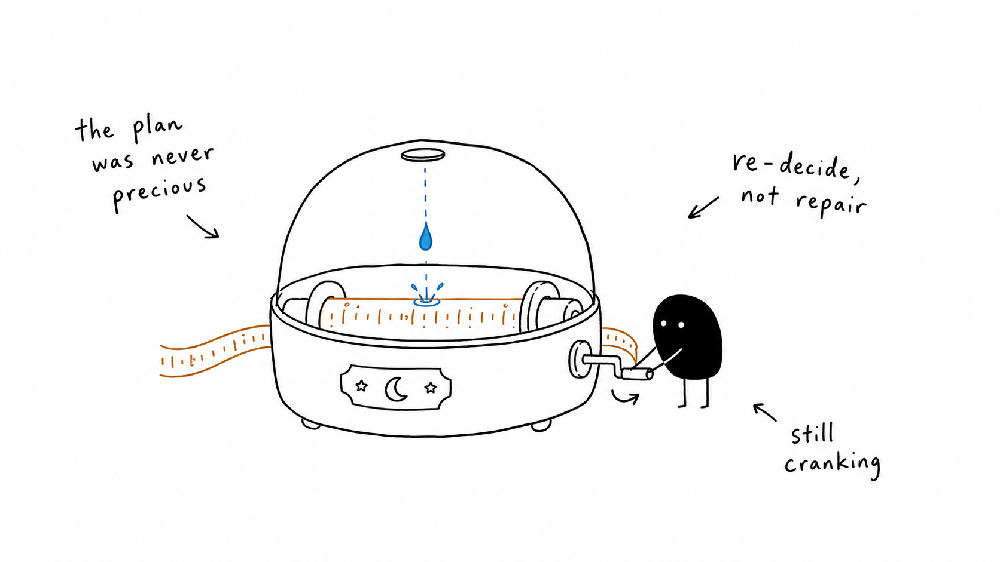
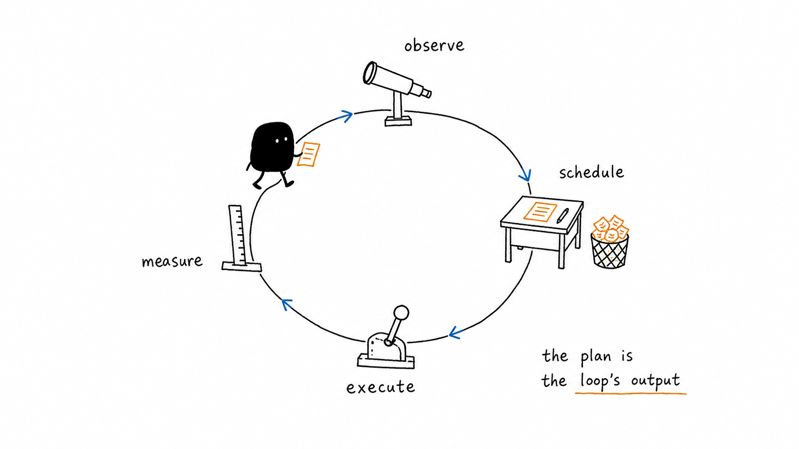
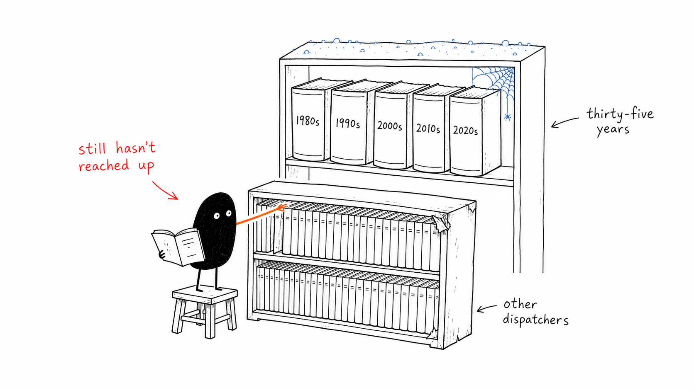
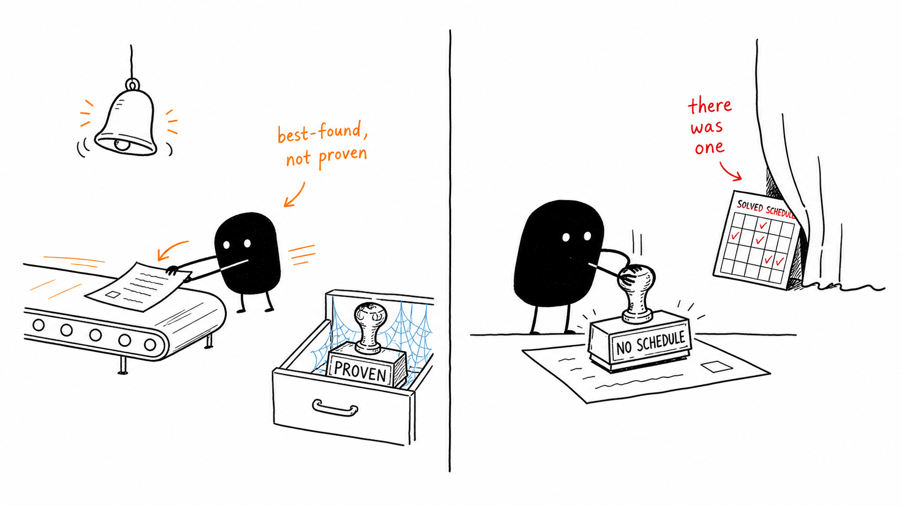
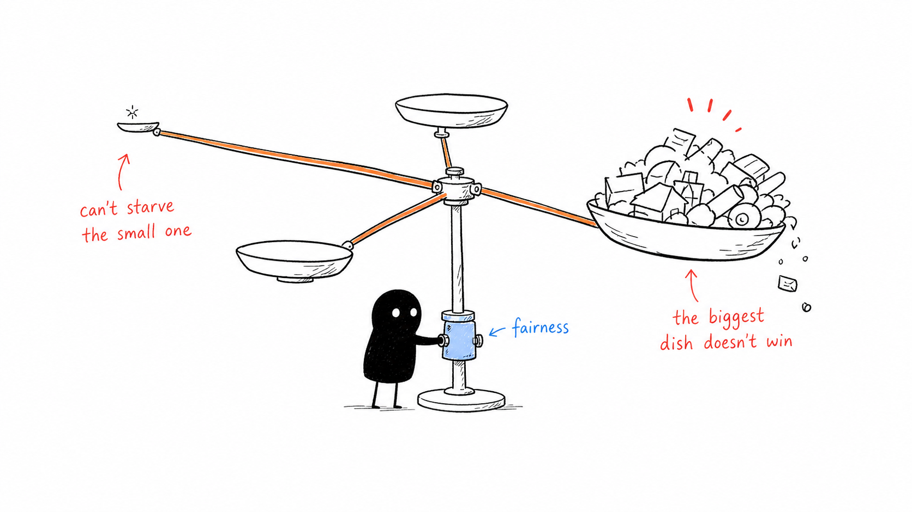
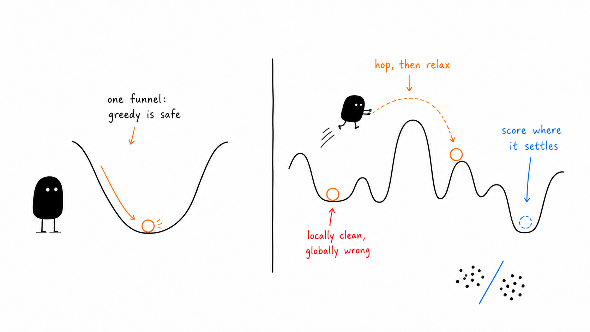
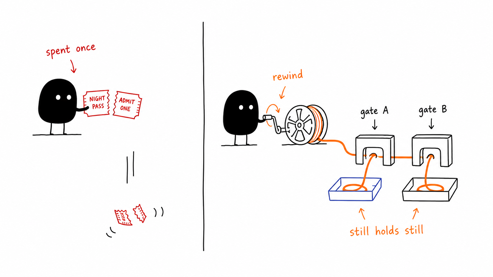

The entire pool-dispatch policy of [Gas City](/projects/gascity), an agent-fleet orchestrator, is one shell line: fetch ready work routed to a given worker pool, drop the blocked and ineligible rows, take the oldest that survives (`workquery.go:127-134`, the tier-3 ordering predicate inside a three-tier discovery contract whose earlier tiers handle crash recovery and pre-assigned work). First come, first served (FCFS), with ordering delegated to whatever the query returns. The autoscaler is one line too: desired sessions equals ready-queue length, clamped to a minimum and maximum defined by the autoscaling configuration. Model selection is a static string in a per-agent config file. There is no lookahead, no load balancing across pool instances, no cost model, and no deadline field anywhere in the work-item data structure.

The software-factory work surveyed here concentrates on worker quality: coding-model capability, memory, and per-agent planning. Dispatch policy receives less attention in this corpus, although it determines what the fleet works on, in what order, at what model tier, and at whose expense. We take the position that a software factory is an online scheduling and resource-allocation system operating under uncertainty, that code generation is one operator inside that optimization loop, and that the loop contains the engineering problems examined here. We compare the system with production observatory schedulers because both allocate constrained resources under changing conditions.

The Zwicky Transient Facility (ZTF) is a deployed instance of online scheduling under changing conditions. Clouds, seeing (atmospheric blur), and target-of-opportunity alerts from gravitational-wave detectors invalidate parts of its plan; the scheduler then discards the stale schedule and recomputes it. The scheduler divides the night into thirty-minute blocks and assigns work to blocks by solving an integer program, an exact optimization over yes-or-no assignments, that maximizes how much sky is searched per unit time. Inside each block it solves a traveling-salesman tour to minimize slew (repointing) time between targets ([`2019PASP..131f8003B`](https://ui.adsabs.harvard.edu/abs/2019PASP..131f8003B/abstract), 340 citations, in production since 2018). It has run this way since 2018 on a problem structurally identical to agent-fleet dispatch: hundreds of tasks with priorities, time windows, precedence, sequence-dependent switching costs, shared serial resources, fairness across competing programs, and an environment that invalidates the plan several times a night.

We call the software systems agent orchestrators. Functionally they are online schedulers, and astronomy has fielded online schedulers under the documented constraints below for thirty-five years. The claim of this report: the seams Gas City deliberately left empty, the constants [Gas City Packs](/projects/gascity-packs), its reusable-configuration layer, currently fills with hand-tuned values, and the threshold predicates [Agent-Oriented Architecture](/projects/aoa) (AOA), a code-architecture measurement toolkit, uses as gates are, one for one, the slots of that optimization loop, and each slot has a deployed, published mechanism behind it. The corpus survey found zero papers applying any of it to continuous-integration (CI) systems, merge queues, or agent fleets. The mechanisms are fielded and published in astronomy, and the insertion points already exist as configuration seams that require no Go edits until late in the adoption path.

## Correspondence between observatory and software-factory scheduling

An observatory is a factory whose raw material is photons and whose product is measurements. It has a backlog of approved observation requests, each with a scientific priority and an eligible time window. It has agents, telescopes and instruments, some interchangeable and some specialized, each with a cost to start up and a cost to switch tasks. It has a review committee upstream deciding what deserves time, an unreliable environment that fails jobs through no fault of the work, and, where applicable, one shared serial resource everybody's output must eventually pass through. The companion essay provides further detail. The correspondence must be exact because the argument uses it at every seam.

| Observatory | Software factory |
|---|---|
| Telescope with an instrument mounted | Execution agent: one worker session |
| The sky | The codebase |
| Observation queue | Work-item backlog |
| Time-allocation committee | Whoever decides what deserves agent time |
| Clouds rolling in | Requirements changing under running work |
| Seeing (atmospheric blur) | Context quality |
| Slew time between targets | Context switching between tasks |
| Dark hours, renewed daily, unbankable | Wall-clock compute and token budget |
| Instrument availability | Tool and environment availability |
| Weather losing an exposure | A flaky test failing a run the work did not deserve |
| Target-of-opportunity alert | Customer incident, escalation, interrupt |
| The one instrument all data must pass through | Human review bandwidth |
| Night scheduler | The factory optimizer, which mostly does not exist |

The correspondence extends to mechanisms outside the initial mapping. Adaptive optics measures atmospheric distortion hundreds of times a second and deforms the mirror to cancel it, an instrument-side correction that restores image quality without touching the schedule. The factory analog is mid-session context repair, compaction and re-retrieval that restores a degrading context window without rescheduling the task, and current agent orchestrators do not treat it as a first-class subsystem. An exposure-time calculator predicts how long an observation needs before the committee commits telescope time. Its analog is a per-class, per-tier cost model consulted before dispatch, which is the estimate the tier router maintains and updates from outcomes. These two correspondences provide additional tests of the mapping.

## Execution, planning, and optimization are three different jobs

An observatory separates its systems by name: the telescope control system points and tracks, the observation planning tools turn a science case into schedulable requests, and the scheduler decides what happens tonight. The software-factory world runs all three concerns through the one word "agent," and the conflation hides where the gaps are.

The execution level is a single agent doing a task: a session with a claimed work item, a worktree, a model, a tool budget. The planning level decomposes goals into tasks and orderings. In Gas City this is the formula layer, and the fleet flows (diverge, converge, premortem, stress-test) are planner-level compositions, decisions about how many attempts to run and how to merge them. The optimization level allocates scarce shared resources across everything in flight at once: claim order, pool sizes, model tiers, merge slots, interrupt policy, review bandwidth. Distributed-systems readers can read the hierarchy as data plane, control plane, and the resource manager above both. Operations-research readers can read it as job execution, project planning, and the scheduling problem proper.

The surveyed work concentrates on the execution level. Execution agents and planning harnesses are active research areas, while the optimization level in this factory consists of the FCFS line this report opened with, a one-line autoscaler, and a static model string in a config file. The allocation failures examined here include the wrong item running first, two sessions colliding in one file set, a dependency chain serializing a week of work, an interrupt draining the pool, and six finished changes waiting a day for one human reviewer. Worker intelligence alone does not correct these allocation failures.

## Control-loop model

Strip the domain words away and both survey telescopes run the same block diagram: goals in, a planner turning goals into schedulable units, a scheduler assigning units to instruments under budgets, execution, telemetry back from the instruments and the sky, state estimation turning telemetry into what is true now and how confidently it is known, and a replanning rule deciding when the current schedule is stale enough to discard.

The factory exposes a slot for every box, though several sit empty. Goals are epics and roadmaps, the planner is the formula layer, the scheduler is dispatch plus capacity plus tier routing, execution agents produce diffs, and telemetry is the event bus and the audit ledgers. State estimation, the middle box, is the one the factory has the raw data for but does not yet compute: per-class duration and success distributions, queue state, in-flight session state, all latent in the ledgers, none currently estimated. Replanning fires the way ZTF's does, on a state change from the environment (clouds there, queue events here). Drawing it as a loop promotes four things agent frameworks treat as incidental to first-class components: the objective the scheduler maximizes, the state estimate, the uncertainty attached to that estimate, and the replan trigger. A framework with no explicit slot for these four is an open-loop generator with a queue in front of it. We do not treat it as a reduced instance of this control-loop architecture.

The observatories disagree about where to close the loop, a result that directly constrains the proposed architecture. The Zwicky Transient Facility uses deterministic re-solving: a deterministic integer program solved fresh whenever conditions change, the whole night laid out block by block, provably good against its objective. Rubin Observatory's Legacy Survey of Space and Time (LSST) uses a memoryless feature-based policy that scores every candidate as a weighted sum of handcrafted features and re-decides at every step, absorbing weather loss because any state is a valid restart point ([`2019AJ....157..151N`](https://ui.adsabs.harvard.edu/abs/2019AJ....157..151N/abstract) describes that framework). Read across the survey, the comparative record leans the same way: the deployed systems with quantified uncertainty chose deterministic re-solve or memoryless policies over scenario-tree stochastic planning (optimizing against an explicit branching tree of possible futures), which appears in this literature only as a 2025 preprint ([`2025arXiv250403666R`](https://ui.adsabs.harvard.edu/abs/2025arXiv250403666R/abstract)). Neither system is a planner in the offline sense. Both are closed-loop controllers that observe current state, decide the next action, and observe again, one closing the loop at the block boundary and the other after every exposure. Either architecture is a plausible template for an agent fleet that treats a plan as the current output of a control loop over live state. Across these deployments, cheap re-decision on current state performed better than explicit uncertainty modeling; the evidence therefore supports better-informed re-decision as the next software-factory upgrade.

## Objective function and constraints

The factory runs two optimization mechanisms at different stages, and keeping them apart resolves what otherwise reads as a contradiction. The scheduler optimizes an objective over an epoch. The acceptance gate, a later stage, judges finished candidates on a vector without collapsing it. This section is about the first, and the acceptance section is about the second.

Written down, the scheduler's objective is short. Over an epoch, choose the assignments, orderings, tiers, pool sizes, and preemption holds that maximize the expected value of work that merges and survives, minus everything the schedule itself costs: token and compute spend at the chosen tiers, human attention consumed as review load and interruptions, coordination losses from context switches and merge-conflict rework, and a fairness penalty for the programs the schedule starves. The constraints are the factory's physical facts: seats per pool, one merge-integration slot, CI runner count, a daily token budget that renews and cannot be banked, and the review bandwidth of the humans in the loop, the shared serial instrument from the dictionary above.

Every term is measurable from telemetry this factory already records. Value enters today as declared priority, and should eventually enter as something better calibrated. The merge-and-survive probability per task class and tier is what replayed traces measure and what a router's posterior estimate (its running belief, updated from each outcome) approximates online. Token spend per invocation already comes out of the pricing module. Review latency and interruptions sit in the audit ledgers. Context-switch cost is observable as the spin-up tax between a session's start and its first useful action. Fairness has a worked formulation in the scheduling model of the Deep Space Network (DSN), NASA's shared antenna array for deep-space missions, discussed below, where a schedule that starves a small program pays for it in the objective, visibly.

One rule from the survey applies to the coefficients that weight these terms: treat every coefficient as versioned policy, because in the one published head-to-head where a genetic algorithm and a tuned local search tied, the scientific policy encoded in the fitness function decided the outcome ([`2003A&A...403..357G`](https://ui.adsabs.harvard.edu/abs/2003A%26A...403..357G/abstract)), so the weights get reviewed and diffed like code. What Gas City runs today is this objective with almost every term deleted: value collapsed to arrival order, costs unpriced, fairness unstated, the constraint set a hand-tuned list of constants. The seam sections that follow reinstate the terms one at a time.

## Operations-research formulations

Every mechanism this report borrows has a standing name in operations research (OR), and those names are search keys into the relevant literature. The claim-ordering problem is online scheduling, committing to decisions before future arrivals are known. The work-item dependency graph is job-shop scheduling, the classic problem of ordering jobs across shared machines, generalized to the resource-constrained project scheduling problem (RCPSP). Model tiers are the multi-mode variant's modes, and duration blowups are the territory of stochastic and robust optimization, hedging against modeled randomness or bounded worst cases, with budgeted uncertainty guarding the makespan, the schedule's total length ([`2022arXiv220306983B`](https://ui.adsabs.harvard.edu/abs/2022arXiv220306983B/abstract)). Sequence-dependent switching cost, the warm-worktree and loaded-context tax, is the routing structure at the heart of dynamic vehicle routing, re-planning a fleet's tours as new stops arrive, and the observatories literally solve tours: ZTF runs a traveling-salesman solve inside every block ([`2019PASP..131f8003B`](https://ui.adsabs.harvard.edu/abs/2019PASP..131f8003B/abstract)) and Handley named the sequencing version the Traveling Telescope Problem ([`2024AJ....167...33H`](https://ui.adsabs.harvard.edu/abs/2024AJ....167...33H/abstract)). Re-solving each epoch with in-flight work frozen is receding-horizon optimization, optimizing over a rolling future window and committing only the first step, known as model predictive control (MPC) when an explicit model of the controlled system is available, and the MIPcc23 reoptimization competition (a benchmark series scoring re-solves of a fixed model under perturbed data) defines and scores that regime ([`2023arXiv231114834B`](https://ui.adsabs.harvard.edu/abs/2023arXiv231114834B/abstract)). Hard time caps with shipped schedules are the mark of anytime algorithms, stoppable at any moment while returning the best solution found so far ([`2022ApJ...935...87P`](https://ui.adsabs.harvard.edu/abs/2022ApJ...935...87P/abstract)). Tier choice under a token budget belongs to the multi-armed bandit family of sequential decisions, where every pull both earns reward and reveals information: the general theory in Slivkins ([`2019arXiv190407272S`](https://ui.adsabs.harvard.edu/abs/2019arXiv190407272S/abstract)), the budget-constrained variant in Cayci et al. ([`2020arXiv200300365C`](https://ui.adsabs.harvard.edu/abs/2020arXiv200300365C/abstract)). Both are scored by regret, the gap between what a policy earned and what the best fixed choice in hindsight would have, whose general theory for online decision-making Hazan's online-convex-optimization treatment lays out with its comparator assumptions spelled out ([`2019arXiv190905207H`](https://ui.adsabs.harvard.edu/abs/2019arXiv190905207H/abstract)). The central trade the bandit names is exploration versus exploitation, spending on uncertain options versus repeating known-good ones. Fair division and resource allocation close the list, fielded as coefficients in the DSN's scheduling objective ([`2021arXiv211111628C`](https://ui.adsabs.harvard.edu/abs/2021arXiv211111628C/abstract)).

The observatory papers provide the operational record behind those names: time caps chosen, optimality gaps tolerated, stability scored, and fairness coefficients validated against a real week of operations. Observatories are physical instances of problems operations research has studied for the better part of a century. The corpus survey found little transfer of that work into agent orchestration. A software factory has the same scheduling structure, so its relevant literature includes the same thirty-five years of scheduling papers used by observatory designers.

## Literature review

### The corpus and how it was surveyed

The evidence base is a survey of NASA's Science Explorer (SciX), the discovery interface built on ADS, run as six parallel research agents, one per operations-research facet: linear and mixed-integer programming, network optimization, stochastic and dynamic programming, nonlinear programming with duality and optimality theory, modeling languages and solvers, and metaheuristics with search-based software engineering. The agents made roughly 195 corpus tool calls in total and anchored every finding to a bibcode, ADS's persistent record identifier. The question was narrow: what does the optimization literature in this corpus teach about running an automated software factory, meaning a fleet of coding agents plus the deterministic systems that manage a codebase and its architecture?

### Thirty-five years of observatory scheduling

The corpus's production optimization domain is observatory and spacecraft scheduling, and it is structurally the same problem as agent-fleet dispatch. The arc runs from SPIKE's constraint satisfaction for the Hubble Space Telescope ([`1990aisi.conf....5J`](https://ui.adsabs.harvard.edu/abs/1990aisi.conf....5J/abstract)) through the first production integer linear program (ILP) telescope-network scheduler at Las Cumbres Observatory, a globally distributed network of robotic telescopes ([`2015arXiv150307170L`](https://ui.adsabs.harvard.edu/abs/2015arXiv150307170L/abstract)), ZTF's ILP ([`2019PASP..131f8003B`](https://ui.adsabs.harvard.edu/abs/2019PASP..131f8003B/abstract), 340 citations, in production since 2018), and the 2021 to 2025 wave of mixed-integer programs, models mixing whole-number and continuous decisions: the DSN scheduling antenna time with setup and teardown brackets and cross-mission fairness terms ([`2021arXiv211111628C`](https://ui.adsabs.harvard.edu/abs/2021arXiv211111628C/abstract)), the Atacama Large Millimeter/submillimeter Array (ALMA) re-solving 5,000 to 10,000 scheduling blocks to optimality under dynamic conditions ([`2016A&C....15...90S`](https://ui.adsabs.harvard.edu/abs/2016A%26C....15...90S/abstract)), ZTF target-of-opportunity handling ([`2022ApJ...935...87P`](https://ui.adsabs.harvard.edu/abs/2022ApJ...935...87P/abstract)), and the UVEX ultraviolet space telescope and M4OPT multi-mission scheduling framework ([`2025PASP..137g4501S`](https://ui.adsabs.harvard.edu/abs/2025PASP..137g4501S/abstract)). Taken together, these systems demonstrate the union of constraints a factory scheduler needs, no single one carrying all of them: priorities, time windows, precedence, sequence-dependent switching costs, shared serial resources, fairness across competing programs, an environment that invalidates the plan without warning (weather, which plays the role that agent nondeterminism plays for a software fleet), and continuous replanning. Every element of the factory-scheduling problem has a deployed, published treatment somewhere in this literature.

### Comparative results from deployed schedulers

The survey's negative and comparative results constrain implementation. The first is the deterministic-re-solve-versus-memoryless-policy result stated above as the control loop's closure rule: across these deployments cheap re-decision outperformed scenario-tree stochastic planning. Two additional results constrain the build. Bold and Goerigk's compact robust resource-constrained project-scheduling formulation solves 93.1% of benchmark instances to proven optimality against 65.0% for an improved Benders decomposition, the classical split of a large model into a master problem and subproblems, at 100 to 200 times the speed ([`2022arXiv220306983B`](https://ui.adsabs.harvard.edu/abs/2022arXiv220306983B/abstract)). Price-based Lagrangian decomposition, which coordinates subproblems through prices ([`2022NatSR..1222417B`](https://ui.adsabs.harvard.edu/abs/2022NatSR..1222417B/abstract)), pays off at genuinely large separable scale. Those results support a working hypothesis that requires testing on the real formulation: a work queue of 100 to 10,000 items, at the modeling density this report proposes, should fit in one open-source solver process. The production target-of-opportunity schedulers run anytime, taking a hard time limit and shipping the incumbent (the best solution in hand when the clock stops). The ZTF target-of-opportunity scheduler MUSHROOMS caps at 500 seconds and accepts 2 to 11% optimality gaps (the proven distance from optimal) where proofs do not close ([`2022ApJ...935...87P`](https://ui.adsabs.harvard.edu/abs/2022ApJ...935...87P/abstract)). These schedulers prioritize a usable current plan because an optimality proof may arrive after conditions have changed.

Two results support a vector objective at the gate. Chen, Li, and Yao showed, on their search-based-software-engineering benchmarks, a weighted-sum genetic algorithm converging to points that Pareto search (the frontier of mutually non-dominated candidates) dominates ([`2020arXiv200108236C`](https://ui.adsabs.harvard.edu/abs/2020arXiv200108236C/abstract)), and Dunbar showed even dual bounds for multi-objective integer programs must be bound sets rather than scalars ([`2023arXiv230908801D`](https://ui.adsabs.harvard.edu/abs/2023arXiv230908801D/abstract)). Read together, they show that a single "architecture health score" risks repeating a documented failure; they do not establish that scalars always lose. Goodhart's law, the metric gamed as soon as it becomes the target, is documented here with its fix attached: at the payments company Adyen, across 5.5M lines of code, search operators learned to game the modularity metric monotonically by moving single classes into fresh modules, metric improvement did not predict developer acceptance, and human review had to be the real gate ([`2021arXiv210200701S`](https://ui.adsabs.harvard.edu/abs/2021arXiv210200701S/abstract)). Deterministic metric gates select candidates; an independent judge that was not the optimization target accepts them.

### A reference architecture the deployed systems imply

Read together, the deployed systems imply a four-layer architecture, each layer grounded in a system from the survey. The four layers are the three levels drawn earlier at finer grain: the declarative constraint core and the epoch scheduler are the optimization level, the dispatch policy is the seam where optimization hands off to execution, and the mutation-selection loop is execution and planning fused around a gate. It is the same hierarchy, described at finer grain.

The first layer is a declarative constraint core, the algebraic-modeling-language pattern, an optimization model written declaratively and kept separate from the data it runs on, that Pyomo in Python ([`2009orci.book....3H`](https://ui.adsabs.harvard.edu/abs/2009orci.book....3H/abstract)) and JuMP in Julia ([`2015arXiv150801982D`](https://ui.adsabs.harvard.edu/abs/2015arXiv150801982D/abstract)) exist to provide, with a solver-agnostic intermediate representation between model and solver ([`2020arXiv200203447L`](https://ui.adsabs.harvard.edu/abs/2020arXiv200203447L/abstract)). The declarative model holds the rules and scheduling policy, and queue and repository state form the data instance: agents regenerate the data instance each cycle and revise the model only when policy changes. MCP-Solver ([`2025arXiv250100539S`](https://ui.adsabs.harvard.edu/abs/2025arXiv250100539S/abstract)), a constraint-solving server a language model drives through an editing protocol, shows the write path working: the model edits a MiniZinc model, MiniZinc being a solver-independent constraint-modeling language, item by item, every edit validated before acceptance, solve strictly separated from edit, model state held server-side. On infeasibility, solvers that support it can emit an irreducible infeasible subsystem, an inclusion-minimal set of constraints that cannot all hold at once, meaning dropping any one restores feasibility, though it need not be the smallest such set. The agent's job then reduces to proposing which rule to relax. Solver logs of bounds, gaps, and timing are the audit trail a model's judgment cannot provide: reproducible and appealable.

The second layer is epoch scheduling by a compact anytime mixed-integer program, warm-started (seeded with the previous solve so the solver starts near the answer): re-solve when accumulated state changes trip a cooldown-coalesced controller, accept the incumbent under a hard time limit, freeze in-flight agent sessions as fixed constraints the way ALMA treats a scheduling block as atomic. The reoptimization regime is literally "same formulation, perturbed data every tick," which MIPcc23 ([`2023arXiv231114834B`](https://ui.adsabs.harvard.edu/abs/2023arXiv231114834B/abstract)) defines and scores with an explicit schedule-stability measure. Several observatory formulation components transfer with little modification, and the epoch-scheduling section below lists them with their sources.

The third layer is dispatch between epochs by a memoryless feature policy. Naghib's LSST scheduler ([`2019AJ....157..151N`](https://ui.adsabs.harvard.edu/abs/2019AJ....157..151N/abstract)) scores each ready task as a weighted sum of handcrafted features (age, expected cost, retry count, dependency criticality, historical success by task-type and tier) and tunes the weights by black-box optimization (tuning against outcomes without a gradient) over replayed traces. Any state is a valid restart point, so the same memorylessness that made the policy robust to weather loss makes it robust to agent crashes. Deadline-sensitive queues get a Whittle index, a single near-optimal priority scalar per task trading urgency against completion probability ([`2016arXiv161000399Y`](https://ui.adsabs.harvard.edu/abs/2016arXiv161000399Y/abstract)).

The fourth layer treats agents as mutation operators inside a deterministic selection loop. The automated-program-repair pattern (ARJA, [`2017arXiv171207804Y`](https://ui.adsabs.harvard.edu/abs/2017arXiv171207804Y/abstract)) has agents propose edit scripts and a deterministic evaluation select on tests plus Pareto objectives including diff size. The convergence alarms and independent-swarm arguments that harden this loop appear with the acceptance gates below, where the fleet already runs their analogs.

Economics runs across all four layers. Budgeted bandits route tier and strategy choices, where each pull has random cost in tokens and wall-time and random reward in landed fixes, and the objective is to maximize merges before the budget is exhausted ([`2020arXiv200300365C`](https://ui.adsabs.harvard.edu/abs/2020arXiv200300365C/abstract); [`2019arXiv190407272S`](https://ui.adsabs.harvard.edu/abs/2019arXiv190407272S/abstract)). Shadow prices, the marginal value of loosening a constraint by one unit, rank which binding constraint to relax next, but they are local marginal quantities, so the procedure is to relax, re-solve, and repeat, without extrapolating a multiplier over a finite budget change ([`2022arXiv221103591K`](https://ui.adsabs.harvard.edu/abs/2022arXiv221103591K/abstract)). Capacity planning is adaptive two-stage stochastic programming, a committed baseline plus one revision point after observing early demand ([`2019arXiv190603513B`](https://ui.adsabs.harvard.edu/abs/2019arXiv190603513B/abstract)). Reserve-plus-burst is the two-settlement demand-response Markov decision process ([`2016ecc..conf..204R`](https://ui.adsabs.harvard.edu/abs/2016ecc..conf..204R/abstract)), and the useful lookahead depth has a computable answer, the shortest horizon meeting a target optimality gap ([`2021arXiv210204874S`](https://ui.adsabs.harvard.edu/abs/2021arXiv210204874S/abstract)). When full CI is the expensive fitness call, surrogate-guided evaluation spends real CI only on predicted-best candidates ([`2017arXiv170505018N`](https://ui.adsabs.harvard.edu/abs/2017arXiv170505018N/abstract)) or runs test subsets and extrapolates ([`2016arXiv160507079K`](https://ui.adsabs.harvard.edu/abs/2016arXiv160507079K/abstract)).

### The codebase itself as an optimization problem

The survey also treats the managed codebase as a feasible region: valid architecture states under layering rules, size caps, coverage floors, dependency-direction acyclicity, and budgets, so that local cleanup versus restructuring is local versus global optimization, and the sky the agents keep surveying has a topography of its own. The graph machinery for that half of the problem, community detection for module boundaries, minimum cut for boundary placement, energy-landscape methods for restructuring past greedy reach, is developed with its sources in the architecture-management section below, where AOA's trace-grounded metrics supply the edge weights.

### The evaluation lessons and the open ground

The survey's evaluation findings apply across formulations: replay identical recorded traces under competing policies, require any optimizer to outperform a simple baseline before adoption, validate scheduling kernels on constructed instances with known optima, and retain one exact method because it distinguishes infeasible instances from feasible ones a heuristic misses. The evaluation section applies these four requirements to each proposed method.

The survey found no in-corpus paper applying mixed-integer programming, stochastic programming, restless bandits (bandit problems whose arms keep changing state even while unplayed), or minimum-cut to CI systems, merge queues, agent fleets, or architecture decomposition. The nearest neighbors are datacenter reinforcement-learning schedulers (Decima) and search-based remodularization (Adyen). The corpus therefore provides no precedent for the mixed-integer formulation of agent-fleet dispatch with model tiers as modes, flow-based module-boundary placement, irreducible-infeasible-subsystem-driven rule-conflict diagnostics in a development-infrastructure loop, restless-bandit merge-queue prioritization, or chance-constrained service-level gates for CI (constraints required to hold with a stated probability).

## Current policy mechanisms in Gas City, Gas City Packs, and AOA

The observatory literature records repeated independent implementation of similar schedulers. Las Cumbres built a production integer-program scheduler in 2014 ([`2015arXiv150307170L`](https://ui.adsabs.harvard.edu/abs/2015arXiv150307170L/abstract)), and the Zwicky Transient Facility built one in 2018 ([`2019PASP..131f8003B`](https://ui.adsabs.harvard.edu/abs/2019PASP..131f8003B/abstract)). The surveyed observatories implemented separate schedulers despite facing similar allocation problems, treating the scheduler as integration glue rather than a shared component. The first deliberately multi-mission, open-source scheduling framework in the corpus appeared only in 2025 ([`2025PASP..137g4501S`](https://ui.adsabs.harvard.edu/abs/2025PASP..137g4501S/abstract)). The surveyed software-factory systems add a limitation to this pattern: agent frameworks concentrate on the workers (model quality, memory, per-agent planning) and ship the allocation layer as defaults, with each orchestration project implementing its own priority heuristics, retry logic, and capacity rules.

Gas City's design rule assigns transport to application code and reasoning to models; a judgment call in application code violates that rule. Scheduling policy is therefore pushed out through shell interfaces (the work query, the dispatch query, the scale check, the scheduled controller task check, and the gate condition) and prompt text, where it lands as either transport-grade first-come-first-served or model reasoning. Gas City Packs enforces the same split at the policy level: its scripts are plumbing, and semantic decisions belong in declarative workflows and prompts. What actually fills the interfaces today is a set of constants and switches: a cap of five active sessions per worker pool, a single active slot for the merge-integration stage, scheduled controller task backoff capped at 300 seconds, a two-way metadata switch in the dispatch formula that routes "criteria-only" work to one model and "prescriptive" work to another, lexicographic sort keys in pull-request triage ("priority label, then recency"), and a wake budget of five sessions per controller cycle.

AOA is the same story at the measurement layer. It computes four real metrics from agent traces (retrieval locality, edit locality, invariant discoverability, and mutation surface), then makes every decision with a threshold predicate or a lexicographic sort: audit findings rank by tier, descending measured cost, and title; migrations are admitted one at a time when held-out improvement is positive and the reward-hacking gap does not widen; and the top-level gate is a majority vote over at least five repositories. Gas City does carry routing signals already, the criteria-only/prescriptive switch in `mol-dispatch.formula.toml` among them. What neither system has is any optimizer, bandit, or multi-objective search that consumes those signals to make an allocation decision.

These choices conform to the transport-only invariant. That invariant's own allowed list includes deterministic math, policy enforcement, and mechanical transforms. A priority index computed from declared features, a mixed-integer program solved over declared constraints, a bandit updating declared posteriors: these are deterministic mechanisms over versioned data, closer in spirit to clamping a desired value between a min and a max than to a hidden heuristic. The judgment stays where the invariant assigns it, in what the model writes into the model, and the solving becomes transport. The Bitter Lesson test asks whether a component keeps improving with general compute instead of hand-encoded knowledge. Open-source solvers such as HiGHS, SCIP, and CP-SAT improve on their own compute curve independent of the language model, and the model's role in the loop, authoring and revising the declarative model, improves as models improve. This division of labor already runs in a published system: MCP-Solver ([`2025arXiv250100539S`](https://ui.adsabs.harvard.edu/abs/2025arXiv250100539S/abstract)) has a language model edit a MiniZinc model item by item, every edit validated before acceptance, solve strictly separated from edit, model state held server-side. MCP-Solver therefore provides a published implementation of the invariant's write path from fourteen months ago.

## Dispatch: a priority index in the work-query seam

The insertion requiring the fewest code changes replaces the tier-3 ordering predicate with a ranked claim, giving the observation queue its scoring function. This is a pure configuration change by Gas City's own design because the dispatch configuration is fully overridable per agent, and the replacement policy is Naghib's LSST scheduler transplanted: score each ready work item as a weighted sum of features (age, priority, dependency criticality measured as downstream unblocked work, expected cost for this task class, retry count, historical success rate for task-type and model tier), claim the argmax (the highest-scoring item), and tune the weights offline against replayed queue traces. No transition model is needed, and crash-robustness comes from the claim protocol rather than from any property of the score: the earlier discovery tiers already recover a session that dies mid-claim, and because scoring reads only current queue state, whatever survivor the recovery hands back is a valid input to the next claim.

Deadline-shaped work requires one refinement. Yu, Xu, and Tong showed that scheduling jobs with deadlines and stochastic service times decomposes into a per-job Whittle index, a single priority scalar that, under the standard indexability conditions on the underlying decision process, near-optimally trades urgency against completion probability ([`2016arXiv161000399Y`](https://ui.adsabs.harvard.edu/abs/2016arXiv161000399Y/abstract)). The work-item data model currently carries an optional priority and nothing temporal. A due-date metadata key, or a first-class field, is the prerequisite for any urgency-aware index and is a low-cost schema change to make early.

## Epoch scheduling: the work-item graph is a resource-constrained project schedule

Target-of-opportunity scheduling sets the required decision latency. When a gravitational-wave detector issues an alert, the follow-up scheduler has seconds to choose which fields to image before the optical afterglow fades. ZTF's target-of-opportunity solver caps at 500 seconds. Across 951 simulated alerts most reached proven optimality inside the limit, and the rest returned the best-found schedule at the time limit, with a 100-second cap costing only 64 truncated solves ([`2022ApJ...935...87P`](https://ui.adsabs.harvard.edu/abs/2022ApJ...935...87P/abstract)). The production schedulers in this literature converge on that pattern: a hard time cap, the incumbent taken as the answer, and no wait on an optimality certificate. These results support accepting the incumbent at the time limit, because the plan will be stale before a proof of optimality completes. The software factory inherits the constraint, and the interrupt policy with it, because a target-of-opportunity alert is the customer incident of the correspondence above: the epoch scheduler receives a deadline measured in seconds, returns the best schedule found, and does not wait on a proof, because the merge queue continues to change.

Between claims, the software factory periodically wants a plan, and the work-item graph is literally a resource-constrained project-scheduling instance: activities with finish-to-start precedence (declared dependencies), renewable resources (agent seats per pool, integration-stage slots, CI runners), and non-renewable budgets (daily tokens). The multi-mode variant maps model-tier routing into the same solve: each item offers modes (a heavier model, a mid model, a cheaper model, an external model) with different duration and cost, and the solver picks mode and schedule jointly, which turns the dispatch formula's two-way routing switch into data. Duration uncertainty gets the Bertsimas-Sim budgeted treatment, guarding the makespan against "at most a bounded number of items blow up simultaneously" while avoiding the conservatism of an all-worst-case formulation ([`2022arXiv220306983B`](https://ui.adsabs.harvard.edu/abs/2022arXiv220306983B/abstract)). The natural host is a scheduled controller task: state changes mark the plan dirty, a cooldown coalesces the churn, and one solve per epoch recomputes assignments and re-dispatches. The scheduled-task mechanism already exists and runs without an agent on each controller cycle.

Three formulation components from the observatory papers have direct correspondences. Lampoudi's reservation-start binaries, where a variable equal to one means reservation i starts at slot k and an occupancy map enforces one reservation per resource-slot, model the merge queue and CI-slot booking in a number of constraint rows linear in reservations plus slots ([`2015arXiv150307170L`](https://ui.adsabs.harvard.edu/abs/2015arXiv150307170L/abstract)). The merge-integration stage's single-slot lock becomes a capacity row. Singer's disjunctive interval constraints, requiring two intervals to be separated by at least a gap with an order binary ([`2025PASP..137g4501S`](https://ui.adsabs.harvard.edu/abs/2025PASP..137g4501S/abstract)), turn today's pessimistic project-workspace serialization (one project workspace per item, then the merge-integration stage serializes every merge) into a constraint the solver plans around: two items whose file sets overlap must not overlap in time, and the solver decides who goes first by what the objective prefers. ZTF's two-level decomposition, an assignment integer program over 30-minute blocks followed by an exact tour within each block, is the template for session batching: assign items to agent-session blocks, then order work inside the session to minimize context-switch cost, because a warm project workspace, a loaded repository map, and cached build state are slew time under another name.

The operating rules come from ALMA and the MIPcc23 reoptimization competition. ALMA re-solves on every condition change but treats an in-flight scheduling block as atomic. The factory equivalent freezes running sessions as fixed constraints and never preempts them. MIPcc23 ([`2023arXiv231114834B`](https://ui.adsabs.harvard.edu/abs/2023arXiv231114834B/abstract)) defines the warm-start regime the factory lives in, one formulation with perturbed data every tick, and its scoring measures schedule stability explicitly, because an epoch scheduler that reshuffles everyone's assignments every tick is worse than first-come-first-served in practice even when its makespan is better on paper.

## Capacity planning and tier routing

NASA's Deep Space Network schedules a handful of giant antennas against every active deep-space mission, including a spacecraft launched in 1977 that needs several antennas arrayed together just to be heard. Its scheduling model includes throughput, visibility windows, setup-and-teardown time bracketing every track, and explicit fairness terms balancing each mission's share of satisfied time, validated against a real week of operations ([`2021arXiv211111628C`](https://ui.adsabs.harvard.edu/abs/2021arXiv211111628C/abstract)). The orchestrators surveyed here expose priorities and queues without an optimizer-enforced fairness term. Gas City's current allocation interfaces likewise contain no such term, leaving starvation detection to human intervention. In the DSN's formulation, a coefficient makes a schedule that starves a small program pay for it in the objective. The same model carries the rest of the session economics: setup and teardown are the clone-and-context-load tax, minimum track durations exist because a session too short to do useful work still pays full spin-up cost, and arraying several antennas on one oversized request is several agents co-assigned to one epic under a single completion constraint.

The scale-check interface currently implements a proportional controller with no plant model: it sets desired capacity to queue length, reacting to the error without any model of how the system responds. Wall-clock capacity is the factory's dark hours, renewed daily and unbankable, and merge and review pipelines run intentionally hot against it. The regime for sizing intentionally-hot service systems is heavy-traffic queueing, the asymptotic theory of servers run near saturation, including the recent variant where service-time distributions themselves are unstable ([`2022arXiv220405733A`](https://ui.adsabs.harvard.edu/abs/2022arXiv220405733A/abstract)), which describes agent runtimes across model versions. Near-term mechanisms require less machinery: hysteresis and dwell times (scale-up and scale-down thresholds set apart, plus a minimum hold before reversing) for the unimplemented anti-flapping cooldowns, and a two-settlement structure for capacity, a committed baseline plus burst recourse (extra capacity bought later once demand is seen), which is structurally the demand-response aggregator Markov decision process ([`2016ecc..conf..204R`](https://ui.adsabs.harvard.edu/abs/2016ecc..conf..204R/abstract)) and, in its simplest form, an adaptive two-stage stochastic program whose bounds say one revision point captures most of the value of full multistage planning when demand drifts slowly ([`2019arXiv190603513B`](https://ui.adsabs.harvard.edu/abs/2019arXiv190603513B/abstract)). The static constants available for adaptive control are already enumerable: the wake budget of five per controller cycle, and the fixed stop and interrupt counts per lifecycle wave.

Tier routing has a directly specified formulation, and in the dictionary it is priced instrument selection: which camera to mount for this field. The pricing module already produces per-invocation cost estimates and is explicitly scoped as decision support, yet nothing consumes it for decisions. Each (task-class, tier) pair is an arm with random cost in tokens and wall-time and random reward in merged outcomes, and maximizing merges before the budget dies is the budget-constrained bandit objective exactly ([`2020arXiv200300365C`](https://ui.adsabs.harvard.edu/abs/2020arXiv200300365C/abstract); knapsack-bandit chapter of [`2019arXiv190407272S`](https://ui.adsabs.harvard.edu/abs/2019arXiv190407272S/abstract)). Thompson sampling, which plays each arm with the probability it is currently believed best, run on reward-per-cost, replaces the static routing table and degrades to it under thin data. It also inherits AOA's construct-validity check, the test that a metric measures what it claims: the reward definition ("merged and not reverted within N days") is a declared, versioned choice, advisory until its correlation with an external outcome is confirmed, as AOA's construct module already does for metrics.

## Acceptance criteria under measurement noise

The system has a sanctioned interface waiting for a deterministic acceptance rule: the review-quorum finalizer defines the durable verdict contract but is not yet invoked when declarative workflows are assembled. Two design rules follow, one borrowed from the survey and one that the survey motivates. First, gate signals are noisy: flaky tests, the factory's weather, nondeterministic benchmarks, and model-judge scores are noisy evaluations of the underlying constraint. The general principle for deciding under measurement noise is sequential testing, accumulate evidence until it clears a calibrated margin rather than acting on one reading, and the noisy sequential-quadratic-programming literature, constrained optimization run on noisy measurements ([`2021arXiv211004355O`](https://ui.adsabs.harvard.edu/abs/2021arXiv211004355O/abstract)), is one worked instance of building acceptance criteria that do not thrash on noise. Applied to a verdict, this report's transfer is a rule that requires signal exceeding a noise-calibrated margin rather than a single passing run. Second, the acceptance predicate should test dominance across the objective vector rather than collapse it to a scalar. Chen, Li, and Yao's benchmark result that weighted-sum fitness converges to Pareto-dominated points ([`2020arXiv200108236C`](https://ui.adsabs.harvard.edu/abs/2020arXiv200108236C/abstract)) is the evidence behind that choice, and AOA's own "good" label (improves held-out pass and holds or shrinks the reward-hacking gap) is already a two-objective dominance check. The system-wide version keeps tests, diff size, coverage delta, and review findings as a vector and accepts on dominance within tolerance.

The Goodhart evidence provides empirical support for a design decision all three systems already made. At Adyen, 5.5M lines of code, search operators learned to game the modularity metric monotonically by moving single classes into fresh modules, metric improvement did not predict developer acceptance, and developer review had to be the real gate ([`2021arXiv210200701S`](https://ui.adsabs.harvard.edu/abs/2021arXiv210200701S/abstract)). Metric gates select candidates, and an independent judge that was not the optimization target accepts them, which is the job the fleet's stress-test flow does before a sensitive change ships, an adversary run whose only mandate is to break the candidate. The merge-integration stage's reject-to-pool loop, the pull-request-ship workflow's three-iteration convergence cap, and AOA's held-out conditioning are all instances of the same defense, now with a published industrial failure mode behind it.

The redundant-independent-attempts stance, where redundant independent attempts are the reliability mechanism and premature convergence is intentionally tolerated, also gains quantitative support here. The fleet already runs it as a pair of named flows: diverge fans out N independent agents on uncorrelated context windows so their errors do not correlate, and converge takes the divergent findings into a structured debate that selects and merges only at the end. Gravitational-wave searches run multiple independent particle swarms, population-based stochastic searches, specifically to bound the probability of missing the global peak ([`2010PhRvD..81f3002W`](https://ui.adsabs.harvard.edu/abs/2010PhRvD..81f3002W/abstract)), which is the argument for that fan-out, N no-crosstalk attempts merged only at selection, stated with a number attached. PIKAIA, an astronomy genetic-algorithm library, implements a convergence alarm for the failure mode diverge addresses: its convergence detector drives the mutation rate from population fitness contrast, the spread between the best and the mean score across the population ([`1995ApJS..101..309C`](https://ui.adsabs.harvard.edu/abs/1995ApJS..101..309C/abstract)), firing when the parallel attempts have all collapsed onto the same local fix, the moment the fleet should raise its temperature through prompt variance, model mix, or fresh context seeds.

## Integration of AOA metrics with operations-research methods

The relationship between AOA and the optimization layer runs both directions. Forward: AOA's four metrics are candidates for the system's architecture-management objective vector because they are trace-grounded measurements of agent-legibility and come with declared parameters (the retrieval cutoff, mutation depth, floor and ceiling) already emitted as data. A boundary-placement optimizer needs edge weights. Retrieval and edit locality, computed per module from real traces, provide coupling weights grounded in observed agent behavior; co-change counts alone lack that direct behavioral grounding.

Backward: AOA's own premortem flow, six independent failure-lens agents each writing a prospective postmortem ("it is six months out and the project failed") without seeing the others, returned a central finding, all six lenses breaking the same single blocking gate, with the shared theme that declaring the over-approximation as data makes ambiguity visible without making verdicts robust. That is a problem with known operations-research shapes. A majority vote over five repositories is a point verdict; interval verdicts with certificates provide an alternative. Duality, the price-side reading of the same optimization, gives bounds (this migration's held-out improvement is at least X under the declared weights, at most Y under the adversarial ones). By analogy, the flat-truncation certificates that prove a numerical result insensitive to a truncation choice ([`2011arXiv1106.2384N`](https://ui.adsabs.harvard.edu/abs/2011arXiv1106.2384N/abstract)) suggest a gate that proves a verdict insensitive to contested parameter choices. Reporting a dominance region instead of a scalar rank addresses the rankings-flip-under-floor-versus-ceiling failure. The migration roadmap's one-at-a-time admission policy (never batch, each candidate admitted only on the "good" label) is a sequential decision process currently run as a fixed ordering. With reward equal to the good label and cost equal to evaluation spend, it is a budgeted bandit over the candidate fix set, and the exploration it adds is exactly what a fixed ordering forecloses.

One correspondence warrants testing. AOA's budget module enforces a token ceiling over the transitive closure of context files, including every file reachable by following imports. DALiuGE, the Square Kilometre Array's dataflow scheduler ([`2018arXiv180507568W`](https://ui.adsabs.harvard.edu/abs/2018arXiv180507568W/abstract)), partitions a dataflow graph under the constraint that concurrently-active resource demand per partition stays under node capacity, and its published negative result is that partitioning the whole static graph is both wasteful and ill-posed because only the temporal working set matters. The constraints differ in scope: AOA's ceiling is static, bounding a reachable set, whereas DALiuGE's binds concurrent demand over time. The shared warning transfers to the unit of architecture optimization: the active frontier of the repository under an agent's context capacity.

## Architecture optimization methods

For the codebase itself, the sky in the dictionary, the survey's graph results give the deterministic half of an architecture loop. Community detection over the symbol and file dependency graph, weighted by AOA's locality metrics, proposes module and ownership boundaries. The algorithm choice matters because Louvain can emit disconnected communities, which are invalid as package boundaries, while Leiden guarantees connectivity ([`2019NatSR...9.5233T`](https://ui.adsabs.harvard.edu/abs/2019NatSR...9.5233T/abstract)), and refactoring via community detection is published practice ([`2018arXiv181110171R`](https://ui.adsabs.harvard.edu/abs/2018arXiv181110171R/abstract)). Boundary placement between two specific subsystems is a minimum-cut query, finding the cheapest set of edges whose removal separates the two sides. The almost-linear-time maximum-flow result ([`2022arXiv220300671C`](https://ui.adsabs.harvard.edu/abs/2022arXiv220300671C/abstract)) puts the theoretical complexity of that query within reach of a per-commit budget on a large single-repository codebase (a monorepo); practical constant factors remain to be verified. The survey found no paper applying flow-based boundaries to software, so this transfer is claimable. The resulting refactoring plans use edit scripts as their representation, a choice three literatures converged on independently: academic remodularization ([`2020arXiv200506510W`](https://ui.adsabs.harvard.edu/abs/2020arXiv200506510W/abstract)), the Adyen work ([`2021arXiv210200701S`](https://ui.adsabs.harvard.edu/abs/2021arXiv210200701S/abstract)), and program repair ([`2017arXiv171207804Y`](https://ui.adsabs.harvard.edu/abs/2017arXiv171207804Y/abstract)). Incremental fitness on diffs is cheap, and plans map one-to-one onto reviewable pull-request-sized changes, which is also the representation AOA's migration plans already use.

For restructuring that greedy agents cannot reach, the chemical-physics energy-landscape corpus provides a candidate method, though the transfer is a hypothesis this report proposes and has not measured in codebases. In molecular energy landscapes, funnel topography predicts optimization difficulty ([`2000cond.mat..7338D`](https://ui.adsabs.harvard.edu/abs/2000cond.mat..7338D/abstract)). The conjecture here is that a codebase behaves the same way, a single-funnel one improving under greedy local cleanup while a multi-funnel one, several plausible decompositions separated by large-diff barriers, traps greedy agents in locally-clean-but-globally-wrong states. Basin-hopping ([`1998cond.mat..3344W`](https://ui.adsabs.harvard.edu/abs/1998cond.mat..3344W/abstract)) is the molecular protocol for crossing a barrier: take a deliberately disruptive perturbation, immediately run local cleanup, and accept or reject on the post-cleanup score. That acceptance rule maps onto "let an agent attempt the disruptive change, then judge the cleaned-up result," and it justifies temporarily holding a worse intermediate state inside a multi-step workflow whose gate only fires after the cleanup step. The experiment that would settle it: seed a real refactor as a basin-hopping perturbation on a codebase whose decompositions are known, and check whether post-cleanup acceptance reaches structures greedy cleanup provably cannot.

## Constraint-model integration in Gas City Packs

Gas City Packs independently implements the algebraic-modeling-language pattern that Pyomo and JuMP provide ([`2015arXiv150801982D`](https://ui.adsabs.harvard.edu/abs/2015arXiv150801982D/abstract)): declarative manifests and workflow variables hold the model, project-workspace state holds the data, executable code is forbidden from holding policy, and composition is by import. A modeling language would add two mechanisms to this structure. The first is a solve step: the constants in the agent configuration and the routing predicates in workflows become decision variables and constraints the epoch solver reads, so a cap like "five active sessions" becomes either a solver output or a declared hard constraint with a known shadow price. The second is infeasibility certificates. When the declared rules admit no schedule, a solver that supports it can emit an irreducible infeasible subsystem, an inclusion-minimal set of rules that cannot all hold at once, turning "the system is stuck" into "these three rules conflict; relax one." Configuration-name collisions already fail with a clear diagnosis naming the collision. An irreducible infeasible subsystem extends that diagnosis to every policy conflict. The survey found the technique underused even among operations-research practitioners. Solver logs similarly complement the event bus with bounds, gaps, and timing per decision that are replayable and appealable.

Shadow prices close the economics loop, with the documented caution attached. At an epoch optimum, the dual variable on each binding constraint, the price the solve attaches to that constraint, measures what relaxing it by one unit buys: another merge-integration-stage slot, another CI runner, another point of token budget. Khabarov showed extrapolating those multipliers over finite changes produces an arbitrary number ([`2022arXiv221103591K`](https://ui.adsabs.harvard.edu/abs/2022arXiv221103591K/abstract)), so the procedure is to relax one constraint, re-solve, and read the new prices. The factory gets a principled answer to "what should we buy next" without ever trusting a multiplier beyond the margin.

## Evaluation design and baselines

A telescope gets each patch of sky exactly once, so survey teams use simulators to test a scheduler against prior conditions after the real sky has changed. A software factory's arrival and outcome traces can be recorded and replayed under multiple dispatch policies. Its audit ledgers already contain the relevant fields: each work item's arrival time and priority, which worker claimed it and when, how long it ran, what it produced, and whether review accepted it. That ledger is both an experimental instrument and the state-estimation substrate the control loop needs. Replay an identical recorded week under two dispatch policies with the arrival trace held fixed, and the differences between the runs are attributable to policy.

We require replay-based evaluation before accepting any proposed scheduling method. The survey supports a common evaluation protocol across formulations: fixed-trace replay, simple baselines, and known-optimum fixtures. Decima's variance-reduction method ([`2018arXiv181001963M`](https://ui.adsabs.harvard.edu/abs/2018arXiv181001963M/abstract)) generalizes beyond its published reinforcement-learning setting: when comparing two dispatch policies on an input-driven system, replay the identical recorded arrival trace under both, because variation in arrivals can swamp the policy signal. The system records everything needed for this already. The work items and the event bus are the trace. The second gate is SWAY ([`2016arXiv160807617C`](https://ui.adsabs.harvard.edu/abs/2016arXiv160807617C/abstract)): random oversampling plus recursive halving matches evolutionary search at orders of magnitude fewer evaluations across search-based-software-engineering benchmarks, and its authors proposed it as a mandatory baseline because more elaborate optimizers frequently fail to outperform it. Every claim that the mixed-integer program or the bandit beat first-come-first-served must also report the margin over a trivially-tuned priority queue on the same replayed traces. Third, Las Cumbres validated its scheduling kernel on constructed instances with known optima, oversubscribed and undersubscribed regimes both, before trusting it, and the factory's scheduler deserves the same fixture set. The case for keeping one exact method around is the negatives: in Handley's runs the heuristic failed to schedule 7 of 360 instances. Six were genuinely infeasible, and on the seventh the mixed-integer program proved a feasible schedule the heuristic had silently missed ([`2024AJ....167...33H`](https://ui.adsabs.harvard.edu/abs/2024AJ....167...33H/abstract)), which is the same silent-loss class as the dispatch-drop risk the config-layer architecture already flags.

The resulting experiment can be stated precisely. The primary comparison is solver-informed dispatch against the FCFS the factory runs today and a trivially-tuned priority sort, all three on identical replayed arrival traces. The outcomes are priority-weighted flow time, unblocking-value throughput, and per-class p95 (95th-percentile) tails. The power requirement is enough recorded weeks that a real difference clears trace-to-trace variance, making the replay harness and the 7.5 weeks of captured snapshots the gating artifacts. The corpus says nobody has published that experiment for a software factory.

## Methods excluded from the initial evaluation

The initial evaluation excludes several methods. We exclude scenario-tree stochastic planning because the deployed systems with quantified uncertainty in this literature chose deterministic re-solve or memoryless policies, which the factory should exhaust before adding recourse models. We defer Benders and price decomposition until a compact model has demonstrably reached its limits. At work-queue scale, the benchmark evidence above supports the hypothesis that the monolithic model will perform better. We keep the solver out of the per-claim path: the priority index dispatches per claim, while the mixed-integer program runs on epochs under a hard time limit and returns incumbents. We exclude a scalar architecture-health score because the weighted sum has a documented failure mode and AOA's dominance-shaped "good" label already provides the alternative. We do not extrapolate shadow prices beyond the margin. We also exclude a commercial-solver dependency. The surveyed implementations include Gurobi academic licenses without consistent benchmarks against open alternatives; HiGHS, SCIP, and CP-SAT are open and free of any paid application-programming-interface (API). The replay harness remains a prerequisite for accepting any of these claims.

## Adoption: a prerequisite phase, then four config-first phases

| Phase | Change | Seam | Code touched |
|---|---|---|---|
| 0 (prerequisite) | Trace replay harness; deadline metadata; SWAY and FCFS baselines; known-optimum fixture instances | work items plus event bus (read-only) | none (tooling only) |
| 1 | Feature-based priority index replacing FCFS claim; weights tuned on replayed traces | work-query / dispatch-query interface in the dispatch configuration | none (configuration plus one scoring script) |
| 2 | Epoch mixed-integer program (RCPSP plus reservation binaries plus disjunctive project-workspace windows plus tier modes), anytime, warm-started; stability scored | scheduled controller task; merge-integration-stage capacity as constraint rows | new scheduled controller task plus solver sidecar (HiGHS/CP-SAT) |
| 3 | Budgeted-bandit tier router fed by the pricing module; deterministic quorum finalizer with noise-margin verdicts | workflow variables or session setup; the review-quorum finalizer | Go: wire finalizer, add routing hook |
| 4 | Architecture loop: Leiden and min-cut boundaries weighted by locality metrics; basin-hopping restructure protocol; irreducible-infeasible-subsystem surfacing for policy conflicts | metrics pipeline plus migration plans | new analysis tooling; metrics stay measurement-side |

Phase 0 is a prerequisite that builds the measurement substrate against which every later phase is judged, and it changes no behavior. Phase 1 also changes no Go; the observatory evidence places much of the value in informed re-decision over FCFS. Each of the four adoption phases is admitted the way the toolkit admits migrations, one at a time, on replayed-trace evidence against the phase-0 baselines, never batched. Assembled, they close the loop this report drew at the start: observe the queue and the repository, schedule an epoch under a deadline, dispatch and execute between epochs, measure, re-decide. The plan is the loop's current output and is recomputed once the state has drifted. ZTF can therefore resume from the current sky at 20:47 without repairing the stale plan, with the lost exposures accounted for under the new conditions.

## Where the implementation stands (2026-07-11)

Phase 1 has a complete, ready-to-implement design spec as of July 11: a priority-index dispatch policy in the work-query interface. The spec re-verified this report's premises against the current codebase and sharpened two of them. The interface has moved from the general dispatch configuration to the dedicated work-query configuration. The earlier premise limited replacement to tier 3; a custom work query replaces the full three-tier discovery contract, so the scoring script reproduces the crash-recovery and pre-assigned tiers verbatim and changes claim order only. The claim contract is "first eligible element of the JSON (structured text) array the script prints," so once readiness, route eligibility, assigned-work precedence, and failed-claim filtering have selected the eligible set, array order sets priority among those candidates.

The score is Rubin's shape transplanted without modification: a weighted sum where declared priority carries weight 1.00 and the secondary features (due date, unblocking value, age) carry 0.10, 0.08, and 0.06, each normalized to the unit interval from fields the ready-work query already returns. The initial weights encode a band-dominance invariant: adjacent priority bands sit 0.25 apart and the secondary weights sum to 0.24, so declared priority strictly dominates and the index only reorders within a band, which is where FCFS was actually leaving value (an aged, heavily-blocking, due-tomorrow item sitting behind a fresh isolated one). The missing deadline field lands as a due-date metadata convention read only by the scoring script, never enforced. Rollout is three gated stages: shadow mode (log what would have been claimed, change nothing), a one-project canary (a single project running the new policy live while the rest stay on FCFS), then fleet, each admitted on replayed-trace evidence, and FCFS is a point in the weight space, so the tuned index can only lose to it by overfitting, which the temporal holdout (tuning on early weeks, scoring on held-back later ones) catches.

Phase 0 is incomplete as of 2026-07-11. The system's event bus holds about 7.5 weeks of full work-item snapshots (2026-05-19 onward), enough to replay recorded arrivals under FCFS, a trivially-tuned priority sort, and the index on identical traces, reporting priority-weighted flow time (arrival-to-completion time), unblocking-value throughput, and per-class p95 tails. The replay harness is the first component to build: it is a prerequisite for estimating policy effects and for Phases 1 through 4, it produces baseline numbers the factory has not previously measured, and it runs read-only without approvals. As of 2026-07-11, none of the proposed methods is deployed, and fleet-wide dispatch continues to use the one-line FCFS policy described at the start.

## Open research questions

Several quantities a factory optimizer needs remain unknown.

State estimation and uncertainty are the first unknowns. How a factory should estimate the duration and success distributions its scheduler consumes, when every model release redraws them, is unresolved, as is whether a cheap pre-run measurement of context quality can predict whether an expensive run is worth committing. The objective is equally open: which objective functions correlate with business value at the quarter scale, and what the exchange rate is between one engineer interruption and a day of queue latency, a coefficient every schedule sets implicitly and this factory has not measured.

Interruption policy is unresolved at both ends. ALMA freezes in-flight blocks and never preempts, a policy supported for a twelve-minute exposure but untested for a six-hour agent session whose telemetry indicates it is pursuing the wrong approach. The open question is which observed states justify preempting running work for a higher-value arrival. Human review, the shared serial resource, warrants its own queueing treatment: an index policy that scores every waiting item and selects the highest for the reviewer, together with a defensible price for review bandwidth. The current factory model prices token cost while leaving attention unpriced. Exploration is likewise unpriced in both routing and planning: how much budget a router should spend on arms it has little information about, and against which baseline its regret should be charged, are open.

The broadest question is also the simplest: which scheduling policies improve on greedy agent execution, by how much, at what queue depth and dependency coupling, measured on replayed traces, an experiment the corpus indicates has not been published for software factories. A second question a factory can only answer about itself is what telemetry it must expose, arrival traces, per-outcome cost, review latencies, and context-quality measurements, to be optimizable at all: an observatory publishes its scheduler, and a factory seeking the same improvement curve must record the equivalent data on its own operation.

Several of these instruments already exist or are in progress, and under this framework they map to distinct functions in the control loop. CodeScaleBench evaluates the execution level, and EnterpriseBench evaluates orchestration across repositories, the planning level at fleet scale. Memory work is state estimation. Theory-of-Mind modeling predicts what an agent, or the human a schedule is waiting on, will do next, which is the transition model the policies above assume without stating. Batch-change tooling addresses the many-coupled-tasks regime the RCPSP formulation targets, and evals are the utility estimators the replanning loop consumes.

This report treats generation as improving on the model vendors' compute curve, which is available to every factory and therefore provides limited differentiation. We found no comparable published improvement curve for allocating compute, context, interruptions, or the human-review capacity the rest of the system waits on. We propose measuring dispatch regret and fairness on replayed merge-queue traces as the next empirical test. The remaining research problem is how a software factory should allocate its resources at each decision epoch, which is the question the astronomers addressed between SPIKE and M4OPT.

---

## References

These are the sources behind the literature review, drawn from the survey of the SciX/ADS corpus run as six parallel research agents across the operations-research facets. Every bibcode resolves at NASA ADS.

Key bibcodes, resolvable at ADS:

- [`1990aisi.conf....5J`](https://ui.adsabs.harvard.edu/abs/1990aisi.conf....5J/abstract) (SPIKE, the Hubble Space Telescope scheduling system)
- [`1995ApJS..101..309C`](https://ui.adsabs.harvard.edu/abs/1995ApJS..101..309C/abstract) (PIKAIA, a genetic-algorithm optimization library)
- [`1998cond.mat..3344W`](https://ui.adsabs.harvard.edu/abs/1998cond.mat..3344W/abstract) (basin-hopping global optimization)
- [`2000cond.mat..7338D`](https://ui.adsabs.harvard.edu/abs/2000cond.mat..7338D/abstract) (funnel topography of energy landscapes)
- [`2003A&A...403..357G`](https://ui.adsabs.harvard.edu/abs/2003A%26A...403..357G/abstract) (policy encoded in the fitness function)
- [`2009orci.book....3H`](https://ui.adsabs.harvard.edu/abs/2009orci.book....3H/abstract) (Pyomo modeling language)
- [`2010PhRvD..81f3002W`](https://ui.adsabs.harvard.edu/abs/2010PhRvD..81f3002W/abstract) (independent-swarm particle-swarm optimization)
- [`2011arXiv1106.2384N`](https://ui.adsabs.harvard.edu/abs/2011arXiv1106.2384N/abstract) (flat-truncation certificates)
- [`2015arXiv150307170L`](https://ui.adsabs.harvard.edu/abs/2015arXiv150307170L/abstract) (Las Cumbres integer linear program)
- [`2015arXiv150801982D`](https://ui.adsabs.harvard.edu/abs/2015arXiv150801982D/abstract) (JuMP modeling language)
- [`2016A&C....15...90S`](https://ui.adsabs.harvard.edu/abs/2016A%26C....15...90S/abstract) (ALMA scheduler)
- [`2016arXiv160507079K`](https://ui.adsabs.harvard.edu/abs/2016arXiv160507079K/abstract) (FABOLAS, cheap-subset hyperparameter tuning)
- [`2016arXiv160807617C`](https://ui.adsabs.harvard.edu/abs/2016arXiv160807617C/abstract) (SWAY, a random-sampling baseline optimizer)
- [`2016arXiv161000399Y`](https://ui.adsabs.harvard.edu/abs/2016arXiv161000399Y/abstract) (deadline restless bandits)
- [`2016ecc..conf..204R`](https://ui.adsabs.harvard.edu/abs/2016ecc..conf..204R/abstract) (two-settlement Markov decision process)
- [`2017arXiv170505018N`](https://ui.adsabs.harvard.edu/abs/2017arXiv170505018N/abstract) (FLASH, surrogate-guided configuration search)
- [`2017arXiv171207804Y`](https://ui.adsabs.harvard.edu/abs/2017arXiv171207804Y/abstract) (ARJA, evolutionary automated program repair)
- [`2018arXiv180507568W`](https://ui.adsabs.harvard.edu/abs/2018arXiv180507568W/abstract) (DALiuGE dataflow scheduler)
- [`2018arXiv181001963M`](https://ui.adsabs.harvard.edu/abs/2018arXiv181001963M/abstract) (Decima, a datacenter scheduler)
- [`2018arXiv181110171R`](https://ui.adsabs.harvard.edu/abs/2018arXiv181110171R/abstract) (remodularization via community detection)
- [`2019AJ....157..151N`](https://ui.adsabs.harvard.edu/abs/2019AJ....157..151N/abstract) (LSST feature scheduler)
- [`2019PASP..131f8003B`](https://ui.adsabs.harvard.edu/abs/2019PASP..131f8003B/abstract) (ZTF integer linear program)
- [`2019arXiv190407272S`](https://ui.adsabs.harvard.edu/abs/2019arXiv190407272S/abstract) (multi-armed bandits survey)
- [`2019arXiv190603513B`](https://ui.adsabs.harvard.edu/abs/2019arXiv190603513B/abstract) (adaptive two-stage stochastic programming)
- [`2019arXiv190905207H`](https://ui.adsabs.harvard.edu/abs/2019arXiv190905207H/abstract) (online convex optimization and regret)
- [`2019NatSR...9.5233T`](https://ui.adsabs.harvard.edu/abs/2019NatSR...9.5233T/abstract) (Leiden community detection)
- [`2020arXiv200108236C`](https://ui.adsabs.harvard.edu/abs/2020arXiv200108236C/abstract) (search-based-software-engineering weighted-sum failure)
- [`2020arXiv200203447L`](https://ui.adsabs.harvard.edu/abs/2020arXiv200203447L/abstract) (MathOptInterface, a solver-agnostic model layer)
- [`2020arXiv200300365C`](https://ui.adsabs.harvard.edu/abs/2020arXiv200300365C/abstract) (budget-constrained bandits)
- [`2020arXiv200506510W`](https://ui.adsabs.harvard.edu/abs/2020arXiv200506510W/abstract) (academic remodularization)
- [`2021arXiv210200701S`](https://ui.adsabs.harvard.edu/abs/2021arXiv210200701S/abstract) (Adyen remodularization)
- [`2021arXiv210204874S`](https://ui.adsabs.harvard.edu/abs/2021arXiv210204874S/abstract) (lookahead depth)
- [`2021arXiv211004355O`](https://ui.adsabs.harvard.edu/abs/2021arXiv211004355O/abstract) (noisy sequential quadratic programming)
- [`2021arXiv211111628C`](https://ui.adsabs.harvard.edu/abs/2021arXiv211111628C/abstract) (DSN mixed-integer linear program)
- [`2022ApJ...935...87P`](https://ui.adsabs.harvard.edu/abs/2022ApJ...935...87P/abstract) (MUSHROOMS, a ZTF target-of-opportunity scheduler)
- [`2022NatSR..1222417B`](https://ui.adsabs.harvard.edu/abs/2022NatSR..1222417B/abstract) (surrogate-Lagrangian bound-based relaxation)
- [`2022arXiv220300671C`](https://ui.adsabs.harvard.edu/abs/2022arXiv220300671C/abstract) (almost-linear-time maximum flow)
- [`2022arXiv220306983B`](https://ui.adsabs.harvard.edu/abs/2022arXiv220306983B/abstract) (compact robust resource-constrained project scheduling)
- [`2022arXiv220405733A`](https://ui.adsabs.harvard.edu/abs/2022arXiv220405733A/abstract) (high-uncertainty heavy-traffic queueing)
- [`2022arXiv221103591K`](https://ui.adsabs.harvard.edu/abs/2022arXiv221103591K/abstract) (shadow-price extrapolation caution)
- [`2023arXiv230908801D`](https://ui.adsabs.harvard.edu/abs/2023arXiv230908801D/abstract) (multi-objective dual bound sets)
- [`2023arXiv231114834B`](https://ui.adsabs.harvard.edu/abs/2023arXiv231114834B/abstract) (MIPcc23 reoptimization competition)
- [`2024AJ....167...33H`](https://ui.adsabs.harvard.edu/abs/2024AJ....167...33H/abstract) (Traveling Telescope Problem)
- [`2025arXiv250100539S`](https://ui.adsabs.harvard.edu/abs/2025arXiv250100539S/abstract) (MCP-Solver, a language-model-driven constraint solver)
- [`2025PASP..137g4501S`](https://ui.adsabs.harvard.edu/abs/2025PASP..137g4501S/abstract) (UVEX ultraviolet telescope and the M4OPT multi-mission scheduling framework)
- [`2025arXiv250403666R`](https://ui.adsabs.harvard.edu/abs/2025arXiv250403666R/abstract) (scheduling under night-loss uncertainty)
