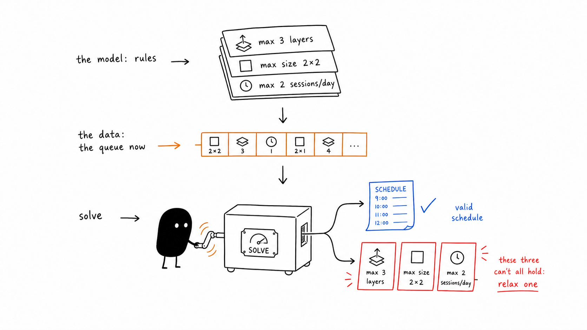

## An agent fleet's throughput is set by its scheduler, not its agents

Gas City dispatches work with one shell line. `gc sling` tags a ready item with the pool it belongs to (`gc.routed_to`), and every worker in that pool runs `bd ready --metadata-field gc.routed_to=<pool> --unassigned --sort oldest`, drops the blocked and ineligible rows, and claims the oldest that survives through a compare-and-swap. The autoscaler is one more line, desired sessions equals that pool's routed-demand count clamped to a configured min and max. Model selection is a static string in a per-agent config file. There is no lookahead, no cost model, and no deadline field anywhere in the work-item data structure. That is the entire allocation layer of a system that runs a fleet of coding agents.

A multi-agent orchestrator is an online scheduler operating under uncertainty. Most orchestration effort today goes into worker quality, meaning model choice, per-agent memory, per-agent planning. Almost none goes into the allocation layer, the part that decides what runs first, in what order, at what model tier, and at whose expense. That layer is where a specific class of failures lives, and no amount of worker intelligence fixes them, because a brilliant agent working on the wrong item is still the wrong item running.

The one word "agent" collapses three levels worth keeping apart. Execution is one agent, one claimed task, one worktree, one model, a tool budget. Planning decomposes goals into tasks and orderings; it includes the fan-out flows that spawn several independent attempts and merge the best one, or throw an adversary at a change before it ships. Optimization is claim order, pool sizes, model tiers, merge slots, interrupt policy, and review bandwidth. Most published multi-agent work sits at the first two levels. In this factory, the third level is the first-come-first-served (FCFS) line, the one-line autoscaler, and the static model string.

<figure class="post__diagram">
<svg viewBox="0 0 820 290" role="img" aria-labelledby="loop-title" style="width:100%;height:auto;color:inherit;">
<title id="loop-title">The allocation layer as a control loop: observe the queue, schedule an epoch, dispatch and execute, measure, then re-decide</title>
<rect x="24" y="44" width="150" height="64" rx="12" fill="currentColor" fill-opacity="0.05" stroke="currentColor" stroke-opacity="0.28"/>
<rect x="222" y="44" width="150" height="64" rx="12" fill="currentColor" fill-opacity="0.05" stroke="currentColor" stroke-opacity="0.28"/>
<rect x="420" y="44" width="150" height="64" rx="12" fill="currentColor" fill-opacity="0.05" stroke="currentColor" stroke-opacity="0.28"/>
<rect x="618" y="44" width="150" height="64" rx="12" fill="currentColor" fill-opacity="0.05" stroke="currentColor" stroke-opacity="0.28"/>
<text x="99" y="72" font-size="14" text-anchor="middle" fill="currentColor"><tspan x="99" dy="0">observe</tspan><tspan x="99" dy="17">the queue</tspan></text>
<text x="297" y="72" font-size="14" text-anchor="middle" fill="currentColor"><tspan x="297" dy="0">schedule</tspan><tspan x="297" dy="17">an epoch</tspan></text>
<text x="495" y="72" font-size="14" text-anchor="middle" fill="currentColor"><tspan x="495" dy="0">dispatch</tspan><tspan x="495" dy="17">and execute</tspan></text>
<text x="693" y="80" font-size="14" text-anchor="middle" fill="currentColor">measure</text>
<g stroke="currentColor" stroke-opacity="0.5" stroke-width="1.5" fill="none">
<line x1="178" y1="76" x2="214" y2="76"/>
<line x1="376" y1="76" x2="412" y2="76"/>
<line x1="574" y1="76" x2="610" y2="76"/>
<path d="M693 108 C 693 244, 99 244, 99 116"/>
</g>
<path d="M222 76 l-10 -5 v10 z" fill="currentColor" fill-opacity="0.6"/>
<path d="M420 76 l-10 -5 v10 z" fill="currentColor" fill-opacity="0.6"/>
<path d="M618 76 l-10 -5 v10 z" fill="currentColor" fill-opacity="0.6"/>
<path d="M99 108 l-6 10 h12 z" fill="currentColor" fill-opacity="0.6"/>
<text x="396" y="236" font-size="13" text-anchor="middle" fill="currentColor" fill-opacity="0.75">re-decide when the state drifts</text>
</svg>
<figcaption class="muted">The allocation layer as a control loop: observe the queue, schedule an epoch, dispatch, measure, then re-decide. The plan is the loop's output, recomputed once the state has drifted.</figcaption>
</figure>

## The failures that live in the allocation layer

Worker intelligence does not touch these, because none of them happen inside a worker. The wrong item runs first while a higher-value one ages. Two sessions collide in one file set and one of them burns its run producing a conflict. A dependency chain serializes a week of work because nothing at claim time knows the chain exists. An interrupt drains the whole pool onto one urgent thing. Six finished changes sit a full day waiting on one human reviewer, which means the true bottleneck was never agent throughput at all.

Each of these is a scheduling decision made badly, or more precisely, not measured. The FCFS is worth stating exactly, because it is neither a bug nor a limit of the tools. The bead store, `bd`, ships three ready-ordering policies: `priority`, its default, which sorts by band then newest-first; `hybrid`, which sorts by band then oldest-first; and `oldest`, which sorts by arrival alone and ignores declared priority. Gas City's pool claim asks for `--sort oldest`, the one mode of the three that throws priority away, in preference to both the default and the `hybrid` mode that would keep first-come fairness inside each priority band. Priority is not dead in the fleet, it just acts on capacity instead of claim order, ranking which pool scales up and ordering work already assigned to a session while a routed P0 waits behind an older routed P2 in the same pool. A deliberate line never measured against the alternatives `bd` already offers is a different and more tractable problem than a bug. Getting off that default takes two changes, each validated against replayed traces before it ships, and a set of rules borrowed from systems that have run online schedulers in production for decades. The full formulations, the literature review behind those rules, and a four-phase adoption path are in the companion report, [Operations research as a framework for software-factory scheduling](/writing/or-for-software-factories/).

## Phase 0: replay your own ledgers before changing anything

The cheapest first build is a read-only trace replay harness, and it should exist before any behavior changes. The orchestrator's audit ledgers already record every arrival, claim, and outcome: arrival time, declared priority, which worker claimed the item and when, run duration, what it produced, and whether review accepted it. Replay an identical recorded week under two dispatch policies with the arrival trace held fixed, and the difference between the two runs is attributable to the policy. No simulator is needed, because the arrivals were captured the first time through.

In Gas City's case, about eight weeks of full work-item snapshots exist, from 2026-05-19 onward. The first job for the harness is baselines: replay the three built-in sort policies (oldest, hybrid, priority) and the phase-1 weighted index over the same trace, and report three numbers per policy: priority-weighted flow time (arrival to completion, weighted by declared priority), unblocking-value throughput (how much downstream work each completed item released), and per-class p95 tails, because a policy that improves the mean by starving one class of work is one you want to catch on paper.

The harness needs no approvals because it changes nothing; it runs read-only over history the system already wrote. What it produces is a set of numbers the fleet has never had: how much the default policy actually costs, in units you can argue about. As of 2026-07-13 the harness has run: `bin/or-replay` replayed eleven weeks of real traffic, 1,286 work beads across 22 pools, and the numbers are in the next section. The fleet still runs the age-only oldest sort, which is why this phase came first.

<figure class="post__diagram">
<svg viewBox="0 0 820 290" role="img" aria-labelledby="replay-title" style="width:100%;height:auto;color:inherit;">
<title id="replay-title">One recorded arrival trace replayed under two dispatch policies, then compared on the same metrics</title>
<rect x="20" y="103" width="170" height="84" rx="12" fill="#cc7a3b" fill-opacity="0.12" stroke="#cc7a3b" stroke-opacity="0.6"/>
<text x="105" y="138" font-size="14" text-anchor="middle" fill="currentColor"><tspan x="105" dy="0">recorded trace</tspan><tspan x="105" dy="18" font-size="12" fill-opacity="0.7">arrivals held fixed</tspan></text>
<rect x="330" y="42" width="210" height="70" rx="12" fill="currentColor" fill-opacity="0.05" stroke="currentColor" stroke-opacity="0.28"/>
<text x="435" y="72" font-size="14" text-anchor="middle" fill="currentColor"><tspan x="435" dy="0">replay · policy A</tspan><tspan x="435" dy="18" font-size="12" fill-opacity="0.7">FCFS baseline</tspan></text>
<rect x="330" y="178" width="210" height="70" rx="12" fill="currentColor" fill-opacity="0.05" stroke="currentColor" stroke-opacity="0.28"/>
<text x="435" y="208" font-size="14" text-anchor="middle" fill="currentColor"><tspan x="435" dy="0">replay · policy B</tspan><tspan x="435" dy="18" font-size="12" fill-opacity="0.7">priority index</tspan></text>
<rect x="630" y="103" width="170" height="84" rx="12" fill="currentColor" fill-opacity="0.05" stroke="currentColor" stroke-opacity="0.28"/>
<text x="715" y="138" font-size="14" text-anchor="middle" fill="currentColor"><tspan x="715" dy="0">compare</tspan><tspan x="715" dy="18" font-size="11" fill-opacity="0.7">flow time · unblocking · p95</tspan></text>
<g stroke="currentColor" stroke-opacity="0.5" stroke-width="1.5" fill="none">
<path d="M190 145 C 250 145, 270 77, 326 77"/>
<path d="M190 145 C 250 145, 270 213, 326 213"/>
<path d="M540 77 C 590 77, 600 145, 626 145"/>
<path d="M540 213 C 590 213, 600 145, 626 145"/>
</g>
<path d="M330 77 l-10 -5 v10 z" fill="currentColor" fill-opacity="0.6"/>
<path d="M330 213 l-10 -5 v10 z" fill="currentColor" fill-opacity="0.6"/>
<path d="M630 145 l-10 -5 v10 z" fill="currentColor" fill-opacity="0.6"/>
</svg>
<figcaption class="muted">One recorded arrival trace, replayed under two dispatch policies. With arrivals held fixed, the difference between the runs is the policy.</figcaption>
</figure>

## Phase 1: the index measured out to a one-word swap

The candidate change is a feature-weighted priority index in place of the `--sort oldest` line: score every ready candidate, take the highest, and decide again on the next claim, the way the Rubin Observatory points a billion-dollar survey. Score each ready item as a weighted sum of four features, with the three secondary features each normalized to the unit interval before weighting:

- declared priority, weight 1.00
- due date, weight 0.10
- unblocking value (how much downstream work completion releases), weight 0.08
- age, weight 0.06

One invariant makes this safe to deploy. Adjacent priority bands sit 0.25 apart, and because each secondary feature is scaled to the [0, 1] interval, the three secondary weights can add at most their sum, 0.24, so declared priority strictly dominates and the index can only ever reorder items within a priority band. This restores priority as the primary key, which the current `--sort oldest` line drops entirely, so a routed P0 stops losing to an older P2 in its pool, and it bounds the secondary features so they reorder only inside a band and never across one, which keeps cross-band ordering, the thing humans reason about when they set a priority, guaranteed by construction rather than by hope. Within-band ordering is exactly where FCFS was leaving value on the floor: an aged, heavily-blocking, due-tomorrow item stuck behind a fresh, isolated one of the same declared priority, losing on arrival time alone.

<figure class="post__diagram">
<svg viewBox="0 0 840 400" role="img" aria-labelledby="bd-title" style="width:100%;height:auto;color:inherit;">
<title id="bd-title">Priority bands sit 0.25 apart; the secondary weights sum to 0.24, so reordering stays within a band</title>
<rect x="40" y="55" width="440" height="70" rx="10" fill="currentColor" fill-opacity="0.05" stroke="currentColor" stroke-opacity="0.28"/>
<rect x="40" y="160" width="440" height="70" rx="10" fill="currentColor" fill-opacity="0.05" stroke="currentColor" stroke-opacity="0.28"/>
<rect x="40" y="265" width="440" height="70" rx="10" fill="currentColor" fill-opacity="0.05" stroke="currentColor" stroke-opacity="0.28"/>
<text x="62" y="97" font-size="20" font-weight="600" fill="currentColor">P0</text>
<text x="62" y="202" font-size="20" font-weight="600" fill="currentColor">P1</text>
<text x="62" y="307" font-size="20" font-weight="600" fill="currentColor">P2</text>
<line x1="150" y1="205" x2="450" y2="205" stroke="#cc7a3b" stroke-width="2"/>
<path d="M150 205 l12 -6 v12 z" fill="#cc7a3b"/>
<path d="M450 205 l-12 -6 v12 z" fill="#cc7a3b"/>
<circle cx="220" cy="205" r="6" fill="#cc7a3b"/>
<circle cx="380" cy="205" r="6" fill="#cc7a3b"/>
<text x="300" y="188" font-size="13" text-anchor="middle" fill="currentColor" fill-opacity="0.85">reorder within band</text>
<text x="300" y="223" font-size="11.5" text-anchor="middle" fill="currentColor" fill-opacity="0.6">due 0.10 · unblock 0.08 · age 0.06</text>
<text x="40" y="362" font-size="13" fill="currentColor" fill-opacity="0.7">Higher priority band = higher score floor</text>
<text x="684" y="86" font-size="13" text-anchor="middle" fill="currentColor" fill-opacity="0.85">0.24 &lt; 0.25</text>
<rect x="600" y="110" width="56" height="220" rx="4" fill="currentColor" fill-opacity="0.12" stroke="currentColor" stroke-opacity="0.3"/>
<rect x="700" y="119" width="56" height="211" rx="4" fill="#cc7a3b" fill-opacity="0.45" stroke="#cc7a3b" stroke-opacity="0.7"/>
<line x1="596" y1="110" x2="772" y2="110" stroke="currentColor" stroke-opacity="0.4" stroke-dasharray="4 4"/>
<text x="628" y="352" font-size="13" text-anchor="middle" fill="currentColor">0.25</text>
<text x="628" y="370" font-size="11" text-anchor="middle" fill="currentColor" fill-opacity="0.7">band gap</text>
<text x="728" y="352" font-size="13" text-anchor="middle" fill="currentColor">0.24</text>
<text x="728" y="370" font-size="11" text-anchor="middle" fill="currentColor" fill-opacity="0.7">secondary</text>
</svg>
<figcaption class="muted">Priority sets the band; the secondary features reorder items inside it. Their weights sum to 0.24, just under the 0.25 band spacing, so an item never crosses into a neighboring priority band.</figcaption>
</figure>

Tune the weights offline against the replayed traces from Phase 0. In Gas City this lands as a pure configuration change, because the claim probe is a per-agent `work_query` shell command: the ordering is not baked into `bd` or `gc`, only the choice of which `bd ready --sort` to call is. The cheapest version needs no scoring script at all, only switching the pool from `--sort oldest` to `--sort hybrid`, which recovers priority-banding with first-come fairness inside each band; the weighted index is the increment on top, adding a due date and an unblocking-value signal that no built-in mode carries. Crash-robustness comes from the existing claim protocol, not from any property of the score, so a bad score costs ordering quality and nothing else. The missing deadline field arrives as an optional metadata convention that the scoring script reads and never enforces, which means items without deadlines behave exactly as before.

The replay settled it, and not in the index's favor. Over eleven weeks the age-only sort ran a priority-weighted flow time of 6.84 hours; `hybrid`, `priority`, and the four-feature index all landed at 6.70 hours, a 2.0 to 2.1 percent gain over age-only and, tellingly, within 0.1 percent of each other. The extra due-date, unblocking-value, and age features bought nothing measurable over plain priority banding on this traffic. The gain that does exist is real but narrow: it concentrates in the genuinely contended pools, +10.1 percent on the EnterpriseBench workers, while the large near-unbounded polecat pool barely moves at +0.7 percent, and it improves the P1 tail from 20.4 to 18.8 hours without tripping the per-class starvation guard. A spec that asked the index to clear the one-word swap by fifteen percent got 0.1 percent, which is a rejection. What ships, if anything ships, is the one word.

Roll that one word out through the same gates the index would have needed. Shadow mode first: log what `--sort hybrid` would have claimed, change nothing, and diff against what `oldest` actually claimed. Then a one-project canary on EnterpriseBench, where the +10 percent lives, while the rest of the fleet stays on `oldest`. Then fleet-wide. Each stage gates on replayed-trace evidence, not on whether the queue feels better. The discipline is the whole point: the four-feature index was the intuitive, interesting change, and the recorded trace is what caught that it was not worth building.

<figure class="post__diagram">
<svg viewBox="0 0 860 250" role="img" aria-labelledby="rollout-title" style="width:100%;height:auto;color:inherit;">
<title id="rollout-title">Rollout in three gated stages: shadow, then a one-project canary, then fleet</title>
<rect x="20" y="45" width="230" height="120" rx="12" fill="currentColor" fill-opacity="0.05" stroke="currentColor" stroke-opacity="0.28"/>
<rect x="315" y="45" width="230" height="120" rx="12" fill="currentColor" fill-opacity="0.05" stroke="currentColor" stroke-opacity="0.28"/>
<rect x="610" y="45" width="230" height="120" rx="12" fill="currentColor" fill-opacity="0.05" stroke="currentColor" stroke-opacity="0.28"/>
<text x="135" y="88" font-size="19" font-weight="600" text-anchor="middle" fill="currentColor">Shadow</text>
<text x="135" y="115" font-size="13" text-anchor="middle" fill="currentColor" fill-opacity="0.72"><tspan x="135" dy="0">log the claim it would</tspan><tspan x="135" dy="17">make; change nothing</tspan></text>
<text x="430" y="88" font-size="19" font-weight="600" text-anchor="middle" fill="currentColor">Canary</text>
<text x="430" y="115" font-size="13" text-anchor="middle" fill="currentColor" fill-opacity="0.72"><tspan x="430" dy="0">one project live;</tspan><tspan x="430" dy="17">the rest stay on FCFS</tspan></text>
<text x="725" y="88" font-size="19" font-weight="600" text-anchor="middle" fill="currentColor">Fleet</text>
<text x="725" y="115" font-size="13" text-anchor="middle" fill="currentColor" fill-opacity="0.72"><tspan x="725" dy="0">every pool</tspan><tspan x="725" dy="17">runs the index</tspan></text>
<path d="M282 90 l15 15 l-15 15 l-15 -15 z" fill="currentColor" fill-opacity="0.1" stroke="currentColor" stroke-opacity="0.4"/>
<path d="M577 90 l15 15 l-15 15 l-15 -15 z" fill="currentColor" fill-opacity="0.1" stroke="currentColor" stroke-opacity="0.4"/>
<text x="282" y="78" font-size="10.5" text-anchor="middle" fill="currentColor" fill-opacity="0.7">gate</text>
<text x="577" y="78" font-size="10.5" text-anchor="middle" fill="currentColor" fill-opacity="0.7">gate</text>
<line x1="250" y1="105" x2="266" y2="105" stroke="currentColor" stroke-opacity="0.5" stroke-width="1.5"/>
<line x1="298" y1="105" x2="313" y2="105" stroke="currentColor" stroke-opacity="0.5" stroke-width="1.5"/>
<path d="M315 105 l-10 -5 v10 z" fill="currentColor" fill-opacity="0.6"/>
<line x1="545" y1="105" x2="561" y2="105" stroke="currentColor" stroke-opacity="0.5" stroke-width="1.5"/>
<line x1="593" y1="105" x2="608" y2="105" stroke="currentColor" stroke-opacity="0.5" stroke-width="1.5"/>
<path d="M610 105 l-10 -5 v10 z" fill="currentColor" fill-opacity="0.6"/>
<text x="430" y="222" font-size="12.5" text-anchor="middle" fill="currentColor" fill-opacity="0.7">Each stage advances only on replayed-trace evidence; a temporal holdout catches overfitting.</text>
</svg>
<figcaption class="muted">The priority index reaches the fleet through three gates: shadow (no behavior change), a one-project canary, then fleet-wide, each admitted only on replayed-trace evidence.</figcaption>
</figure>

## Context quality is the lever you own

Dispatch order is one lever. Context quality is another, and it is the one most under your control. A run's context window degrades in flight: it fills with stale retrieval, drifts off the task, loses the thread across a long session, and the run fails for reasons that have nothing to do with the model's ability. The reflex is to treat that as noise the scheduler routes around, the way it routes around a flaky test. Most of it originates inside the factory, though, and can be fixed at the source. Compaction, re-retrieval, and mid-session repair restore a degrading window without rescheduling the task, and few orchestrators treat that as a first-class subsystem rather than something each agent improvises. The scheduling decision that matters sits just before dispatch: a cheap read of context quality tells you whether to commit an expensive run now or repair the context first. Most fleets cannot take that reading yet, which is one of the questions still open below.

## Rules from schedulers that already run in production

Observatories have operated online schedulers under uncertainty, with real money on the line, for decades; these are the rules that transfer, each tied to the fleet failure it prevents.

1. **Re-decide cheaply instead of modeling all the uncertainty.** The deployed schedulers that actually quantified their uncertainty chose cheap frequent re-solving over elaborate scenario-tree planning. Make re-decision nearly free: run a real optimization at coarse intervals, score greedily but well in between, and absorb the residual variance instead of forecasting it. Prevents pouring effort into predicting agent flakiness and queue churn instead of just recomputing when the state changes.

2. **Ship the best answer you have when the clock runs out; do not wait on a proof.** A production follow-up scheduler caps its solver at 500 seconds and takes whatever the best schedule is at the cap; a 100-second cap would have truncated only 64 of 951 solves. The merge queue keeps moving. A plan short of proven-optimal but in hand beats a perfect plan for a state that already changed.

3. **Keep one exact method that can say "there was work to do and we provably missed it."** A heuristic silently returns a confident wrong answer; an exact solver certifies. In one study a heuristic failed on 7 of 360 instances, and on one of them a feasible schedule provably existed that the heuristic silently missed. Any dispatcher that can drop work without noticing needs one component that can catch it, even if that component only runs nightly over yesterday's queue.

4. **Write fairness in as a coefficient.** NASA's Deep Space Network writes fairness directly into the objective, so a schedule that starves a small program pays for it visibly in the score. The fleet failure this prevents: one urgent epic arrives and for days every worker feeds it, while maintenance rots and a smaller project's issues age out, and the only current defense is a human noticing.

5. **Accept on a vector, not a scalar.** Collapsing quality to one number gets gamed. At a payments company with 5.5 million lines of code, an automated search learned to game a modularity score by moving single classes into fresh modules, and the score's improvement did not predict whether developers accepted the change. So deterministic metric gates select candidates, and an independent judge that was not the optimization target accepts them. Gas City already runs this shape: a separate adversarial pass, whose only job is to break a sensitive change, runs before it ships.

6. **Route model tier as a budgeted bandit, not a static table.** Each pair of task class and model tier is an arm with a random cost, in tokens and wall-time, and a random reward, defined as merged and not reverted within N days. Play each arm in proportion to the chance it is best per unit cost. With thin data the bandit collapses back to the static table, so the floor is exactly today's behavior. In Gas City the cost estimator already exists; nothing consumes it for the routing decision yet.

7. **Replay recorded traces, not simulated ones.** This is the one structural advantage a software factory holds over a telescope: the telescope sees each patch of sky once and must simulate its past, while the factory recorded its own. Require any proposed optimizer to beat a simple baseline on replayed traces before it ships. Prevents the entire genre of clever schedulers adopted on argument rather than evidence.

## A priority index is not a hidden heuristic

Gas City runs under a strict design rule: transport and plumbing code does mechanics, models do the reasoning, and no semantic judgment gets smuggled into application code as a hardcoded heuristic. A scored dispatch line looks, at first glance, like exactly the thing the rule bans.

It is not, and the distinction matters. A priority index over declared features, a solver over declared constraints, a bandit over declared posteriors: each is a deterministic mechanism over versioned data, closer in kind to clamping a value between a min and a max than to a keyword regex deciding what a task means. The judgment lives in what the model writes into the declarative layer, the priorities, deadlines, and constraints; the solving is transport. This division of labor already has a published implementation, where a language model edits a constraint model one item at a time, every edit validated, with solving strictly separated from editing. It also gains from outside progress: open solvers improve on their own compute curve, independent of anything happening to the language model.

## The quantities still unmeasured

Several of these decide whether any of the above matters at quarter scale. Which objective actually correlates with business value over a quarter is unknown, and flow time is a guess. Whether a cheap pre-run read of context quality can tell you an expensive run is not worth committing is unresolved, and it is the measurement the previous section needs. The exchange rate between one engineer interruption and a day of queue latency is a number every schedule sets implicitly and few teams have measured. When to preempt a running six-hour agent session that telemetry says is pursuing the wrong approach has no principled answer yet, and neither does pricing human-review bandwidth, which the six-changes-waiting-a-day failure suggests is the scarcest resource in the building. A tier router needs an exploration budget for arms it knows little about, and nobody knows how large that budget should be.

One question sits under all of these: which scheduling policies beat greedy agent execution, by how much, at what queue depth and dependency coupling. This city now has one data point, and it is a humbling one: on eleven weeks of its own traffic the answer was about two percent, concentrated entirely in the few pools under real contention, and the elaborate scorer lost to a one-word config change. The surveyed corpus still shows no published answer at a factory's scale, and the traces to run the next one are already sitting in the ledgers.

---

_This is the practitioner's companion to the technical report [Operations research as a framework for software-factory scheduling](/writing/or-for-software-factories/), which carries the full formulations, the literature review, and the four-phase adoption path. For the narrative version of the astronomy correspondence, see [The software factory as an observatory](/writing/the-software-factory-as-an-observatory/). The model/data/solver illustration is in the [ian-xiaohei-illustrations](https://github.com/helloianneo/ian-xiaohei-illustrations) style (MIT-licensed skill by Ian Neo); the other diagrams are inline SVG._
