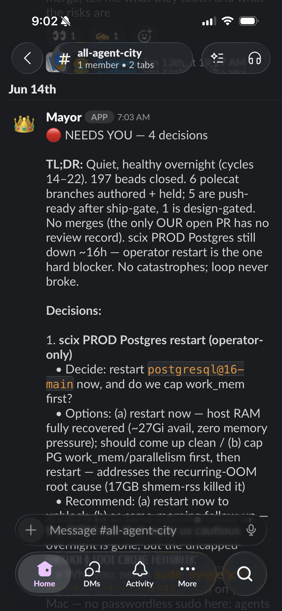
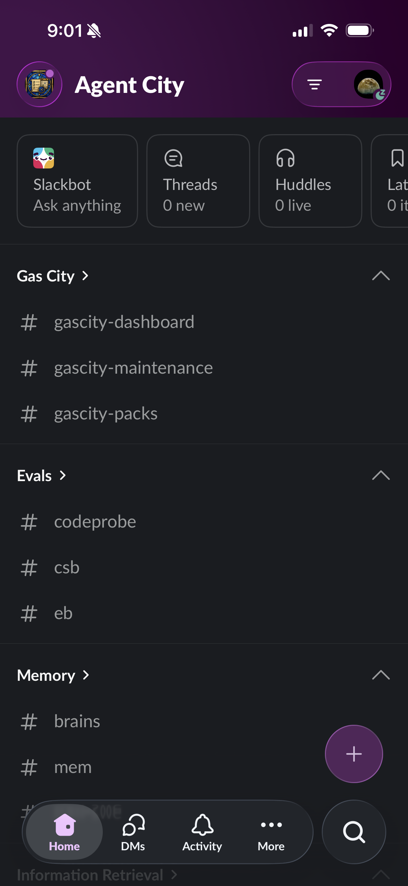
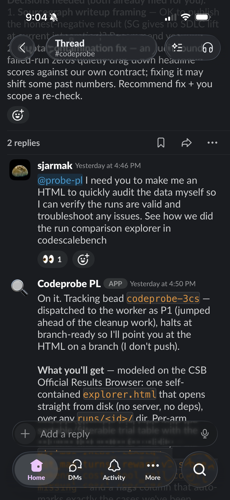
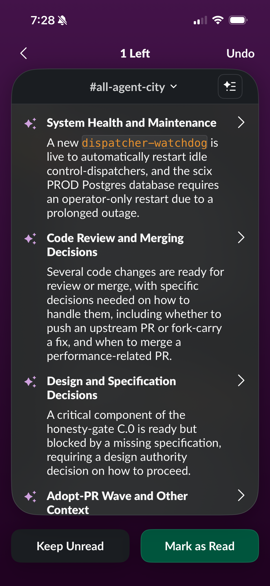
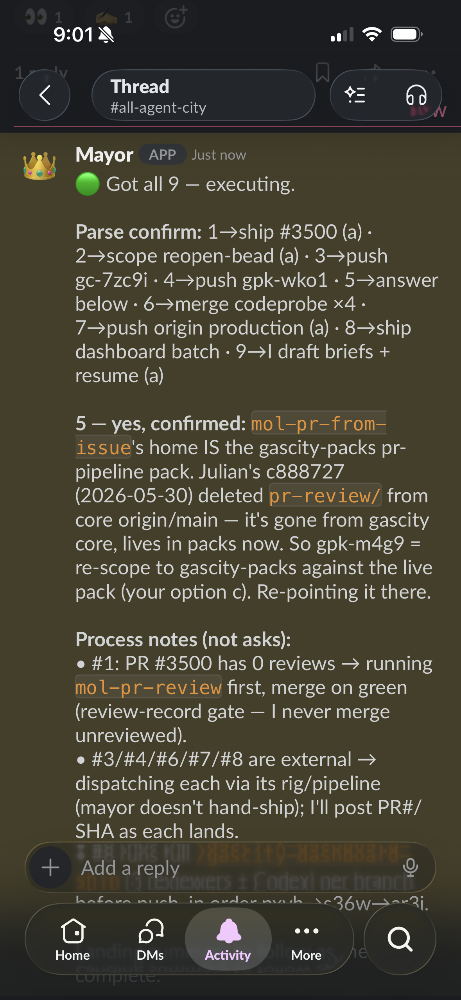

Every morning at 7 AM I get a status report posted to Slack that an agent wrote after orchestrating a bunch of other agents while I was asleep. I still use a custom web and TUI dashboard I'm experimenting with and tmux, but increasingly my aggregated observability looks like a Slack message in a channel called `#all-agent-city`, that usually starts like "🔴 NEEDS YOU — 4 decisions," with a concise overnight summary (it runs with a /overnight-autopilot workflow I set up) and a numbered list of the calls only I can make. I tap a couple of replies, maybe `@mayor: ship 1 and 3, expand on 2`, and go make tea while the work fans back out.



I've been moving more and more of my orchestration surface into Slack, and at this point it's the primary way I drive a fleet of coding agents across my current dozen or so active projects. This post is about how I use it, what I like about it, and the machinery underneath it: [Gas City](https://github.com/gastownhall/gascity) as the orchestration SDK, and a Slack bridge I've been building in its companion `gascity-packs` repo.

Before the architecture, here's what a normal session actually looks like, a short walkthrough of me driving the fleet from the Agent City workspace:

<figure class="post__video"><video controls preload="metadata" playsinline poster="/media/agent-city-slack-demo-poster.jpg" style="width:100%;border-radius:var(--radius);"><source src="/media/agent-city-slack-demo.mp4" type="video/mp4" />Your browser can't play embedded video; <a href="/media/agent-city-slack-demo.mp4">download the demo</a> instead.</video><figcaption class="muted">Driving Gas City from Slack</figcaption></figure>

## Agent city: a slack workspace of rigs 

The mental model is a city. The heritage is Steve Yegge's [Gas Town](https://steve-yegge.medium.com/welcome-to-gas-town-4f25ee16dd04), where you primarily interface with an orchestrator agent named the 'Mayor' who slings out work items called [beads](https://github.com/gastownhall/beads) (which can be thought of like tickets or issues). I'm a maintainer for the next evolution of this, called [Gas City](https://steve-yegge.medium.com/welcome-to-gas-city-57f564bb3607), which is the SDK for building your own agent-driven software factories, where Gas Town is one such instantiation. While experimenting with ways to reduce the friction of operating these systems, I set up a slack workspace I aptly (or lazily) named **Agent City**, and the sidebar is my city org chart: each channel is a 'rig' or project, where I mainly communicate with an assigned Project Lead and the Mayor to monitor and assign work.



Under **Gas City** there's `gascity-dashboard`, `gascity-maintenance`, `gascity-packs`. Under **Evals**: `codeprobe`, `csb`, `eb`. Then **Memory** with `brains` and `mem`, and an **Information Retrieval** group for the SciX and digest work that writes [the rest of this site](/posts/two-retrieval-systems-write-this-site). Each channel maps to a project, and each one has a project lead bound to it that can sling out work to a pool of worker agents. When I post in `#codeprobe`, I'm talking to the codeprobe project lead that lives in that project's context; when I post in `#all-agent-city`, I'm talking to the Mayor, the oversight orchestrator that sees across all of them. I can also tag the Mayor and bring him into any other channel as needed. 

I really like this organizational approach so far. It was getting a bit too chaotic to always have the Mayor dealing with the individual minutiae of a project's work scoping, but doing the initial planning and check-ins with an agent primed on the specifics of the project and then just have the Mayor serve as the cross-rig aggregator that raises infra or project lead blocking issues as they come up works well. 

## Gas City is the infrastructure, you bring the roles

Underneath Slack is [Gas City](https://github.com/gastownhall/gascity), the multi-agent orchestration SDK I mentioned earlier. Its governing idea is **zero hardcoded roles**: the SDK ships infrastructure (sessions, a work ledger, an event bus, config, prompt templates) and nothing that names a "reviewer" or a "mayor" or a "worker." All of that behavior is user-supplied config and Markdown prompt templates. The codebase calls this ZFC, Zero Framework Cognition: the code handles transport and lifecycle, and every judgment call is delegated to a model through a prompt. Work itself lives in **beads** (`bd`), a persistent task store, so when an agent's session crashes or gets restarted the work survives and gets picked back up. Sessions are disposable; the ledger is not.

There is no hardcoded 'Mayor' role in Gas City btw. Hardcoding a role like that at the SDK level would violate the entire premise of Gas City. The Mayor I talk to in Slack is just **a gc session that I aliased to the handle `mayor`**. Same for `@probe-pl`, the "project lead" for the codeprobe eval work: a session, a prompt template that tells it how to behave, and a handle alias so I can `@`-mention it from anywhere. Handled by three lines of CLI:

```bash
# a session is one running agent; a rig is a project/repo registered with the city
gc slack handle-alias --handle mayor    --session gc-2568
gc slack handle-alias --handle probe-pl --session gc-8347
gc slack identity      --as "Mayor" --avatar-emoji crown   # cosmetic persona only
```



In that thread I asked `@probe-pl` to build me an HTML report so I could eyeball some eval runs myself. It replied in-thread, *"On it. Tracking bead `codeprobe-3cs`,"* and went and did it. The bead is the receipt. The "PL" persona is entirely a prompt; if I want it to behave differently I edit Markdown, not Go. That's the Bitter Lesson principle the project leans on hard: every primitive should get more useful as models improve, so you build for the model to reason and you don't bury heuristics in the framework.

So "Mayor" and "PL" are operating styles I expressed in config, dressed up with per-session Slack identities, display name and avatar, so the workspace reads like a team. It's a fiction, but a load-bearing one: it makes a pile of headless processes legible enough that I can supervise them from my phone.

## What I actually built in gascity-packs

The code that powers all this is a custom pack in `gascity-packs`. It's two small Go binaries and a pile of CLI verbs, and the design is deliberately dumb plumbing, with all the policy living in prompts rather than here. An adapter daemon takes a public webhook from Slack's Events API, verifies the HMAC signature and rejects anything stamped more than five minutes old so a captured request can't be replayed, normalizes the event, and POSTs it into Gas City's `extmsg/inbound` API; outbound replies go the other way, from a session back out to `chat.postMessage`. There's no Socket Mode involved, just a plain HTTPS endpoint fronted by a Tailscale Funnel so I don't have to run public infra. Alongside it a CLI (`gc slack <verb>`) writes the registries the adapter reads: `map-channel` binds a channel to a session or rig, `handle-alias` is what makes `@mayor` resolve to a session, and `identity` sets the per-session display name and avatar.

When I `@probe-pl: build me that report` in a thread, the adapter parses the `@handle` prefix, plops a 👀 reaction on my message so I know it landed, fetches the thread context, and dispatches the inbound straight to that session in addition to whatever's bound to the channel. Thread-stickiness means my follow-up replies in the same thread keep going to the same agent without re-addressing. Files attach both directions. The whole thing is concurrency-gated (a dispatch semaphore, 50 slots by default via `SLACK_DISPATCH_CONCURRENCY`) and resource-bounded, because the interesting failure mode of "let agents talk in Slack" is an agent that talks too much.

That signature check buys origin, not authority: HMAC proves the request came from my workspace, not that whoever typed it is allowed to ship code. The bridge has no per-user allowlist, so the trust boundary is the workspace itself, which holds up only because Agent City is mine and I'm the lone human in it. The guardrails that actually matter live one layer down in git: agents author branches, the Mayor merges only our own PRs and only through a review gate, anything destructive needs a human decision, and the nightly ledger exists precisely so those decisions get batched to me instead of taken silently. The day I add a second person to the workspace, a Slack-user allowlist is the first thing I have to build.

It comes in tiers, too. `slack-mini` is barely more than "`@mention` reaches a session," `slack-channel` adds the channel bindings and identities, and the full `slack-pack` adds the cross-channel addressing and multi-app routing. I run the full one, but the tiering exists so the on-ramp is a dozen files instead of a hundred.

## An overnight pipeline and a morning ledger

The Mayor session ran a pipeline through the night, pushing fixups, replying to review threads, and merging our own PRs under a gate, then accumulated every decision it couldn't make unilaterally into a concise format for me to check in the morning. Here is an example one, lightly trimmed:

```text
🔴 NEEDS YOU — 4 decisions

TL;DR: Quiet, healthy overnight (cycles 14–22). 197 beads closed.
6 polecat branches authored + held; 5 push-ready after ship-gate,
1 design-gated. No merges (the one OUR open PR has no review record).
scix PROD Postgres still down ~16h — operator restart is the one
hard blocker. No catastrophes; loop never broke.

Decisions:
1. scix PROD Postgres restart (operator-only)
   • Decide: restart postgresql@16-main now, and cap work_mem first?
   • Options: (a) restart now — host RAM recovered, ~27G avail; or
     (b) cap PG work_mem/parallelism first, then restart.
   • Recommend: (a) restart now.
2. Code review / merging — several branches ready; which to push.
3. Design — honesty-gate C.0 blocked on a missing spec decision.
4. Adopt-PR wave — pull upstream fix or fork-carry it.
```

A "polecat" is a throwaway worker that authors a branch and exits; "push-ready after ship-gate" means the change passed its checks and is waiting on my go/no-go. The categorized version of the same briefing, grouping the work by health, code review, design, and adopt-PR context, looks like this:



Then I answer, and the second screenshot is what dispatch looks like: a confirmation that it parsed my batch of decisions and is executing.



*"Got all 9 — executing,"* then a numbered map of each decision to a concrete action: ship this PR, re-scope that bead, push this branch, draft briefs and resume. Some of those it does itself; some it hands to project-lead sessions, each posting its own PR and bead IDs back as they land. The part of that message I care about most is the "Process notes (not asks)" section, telling me what it's doing that doesn't need my sign-off, which is exactly the boundary I want: act autonomously on the mechanical stuff, batch the judgment calls, and never secretly make a decision.

## Supervising agents: Dashboards vs. Slack

I helped build a general-purpose dashboard for Gas City, there's a `gascity-dashboard` repo with a real SSE-fed UI. But it serves a semi-orthogonal purpose to what I have goin on in Agent City. Slack is where I already am a lot (Slack Bot once called me "terminally online" and I have never recovered), it's async, it's threaded, and it's on my phone. Supervising agents is mostly a 'what-needs-me-for-unblocking' problem rather than a visualization one. The web dashboard UI I built is helpful to drill into the specifics, monitor infra health, and to at a glance see that work is flowing as expected. But, I usually don't need a live graph of forty sessions; I need the three decisions that are blocking progress, surfaced where I'll see them, with enough context to answer in one line.

## Takeaway

If you're interested in making your own Slack agent city check out the [full pack](https://github.com/gastownhall/gascity-packs/tree/main/slack-full), I also made lighter variants under slack-channel and slack-mini, where you could experiment with having your agent city live in a single channel of a separate workspace, or just add a Gas City Mayor bot app to your workspace. If you try it out let me know how it goes, we have a pretty [active discord community](https://discord.com/invite/xHpUGUzZp2), always happy to chat with folks!
